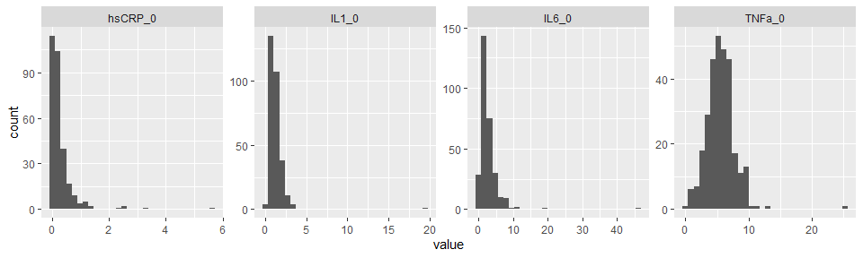
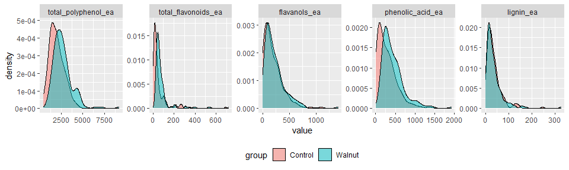
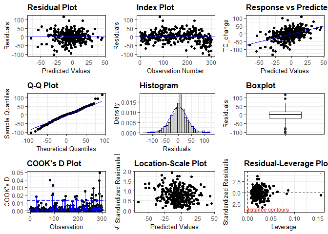
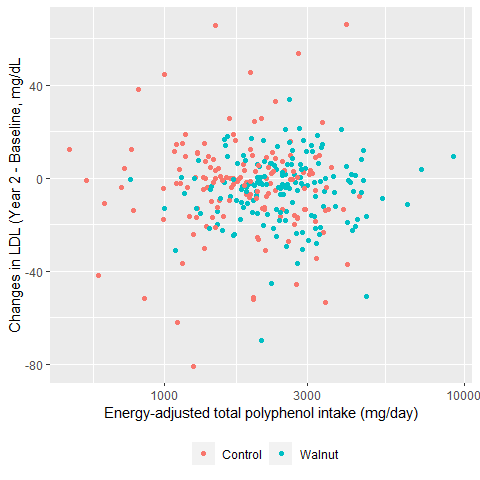
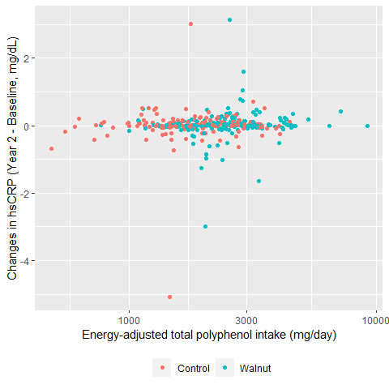
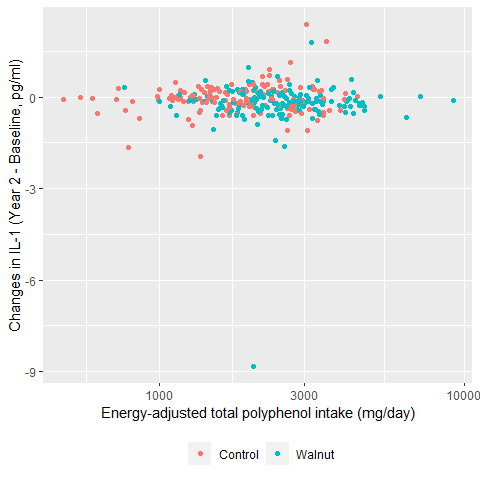
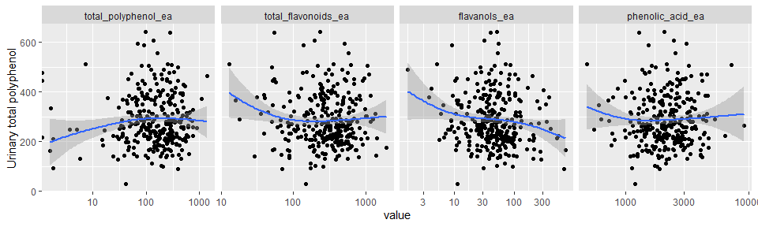
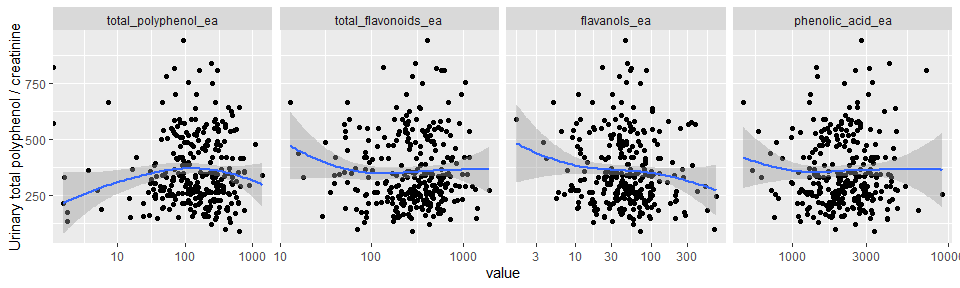

WAHA Polyphenols Study
================

## Datasets

-   A zip file receved from RA:
    `Dietary Polyphenol Lipid and Inflammation files.zip`
    -   Contains:
        -   Lipid file in SPSS: `BDLab_BCNLLU1709lipids.sav`
        -   Inflammation markers file in SPSS:
            `WAHA_ BD_Cytokines_BCN_LLU Inflammation.sav`
        -   Anthropometrics in Excel: `Table1Data.xlsx`
        -   Recall files in CSV:
            `waha-recalls-per-recalls-overlapping-foodgroups-with-pOH.csv`

### Lipid data

-   Includes *n* = 369 subjects.
-   Variables: total cholesterol, LDL, HDL, triglycerides (mg/dL) at
    baseline and year 2. HbA1c values are all missing.

### Inflammatory marker data

-   Includes *n* = 371 subjects.
-   Variables: hsCRP (mg/dL), IL-1 (pg/ml), IL-6 (pg/ml), TNF-a (pg/ml)
    at baseline and year 2.

### Anthropometric data

-   Includes *n* = 356 subjects.
-   Variables: Group, age, gender, race, education, height, weight, BMI,
    etc.

### Dietary recall data

-   Includes 1246 observations from *n* = 334 subjects. The number of
    recalls ranges from 1 to 6 recalls.
    -   There is 1 subject who was not found in lipid and inflammatory
        marker data. This subject was excluded, yielding 1242
        observations from *n* = 333 subjects.
-   Variables: Total energy (kcal/day), total polyphenols, total
    flavonoids, flavanols, phenolic acid, lignin, etc.
-   Dietary polyphenol variables were energy-adjusted each day using the
    residual method and then averaged for each subject.

## Analytic dataset

-   All data files were inner-joined, producing *n* = 333 subjects.
-   For analysis, any subjects who has any missing on lipids and
    inflammatory markers were excluded. This resulted in *n* = 300
    subjects.

## Descriptive table at baseline by treatment

-   Medians (and IQR) were reported for HDL, triglycerides and all
    inflammatory marker variables, as their distributions were
    right-skewed. Mann-Whitney tests were used for these variables for
    comparisons between treatment (`test = nonnormal`)

|                          | level     | Control                 | Walnut                  | p     | test    |
|:-------------------------|:----------|:------------------------|:------------------------|:------|:--------|
| n                        |           | 146                     | 154                     |       |         |
| gender (%)               | F         | 99 (67.8)               | 97 (63.0)               | 0.450 |         |
|                          | M         | 47 (32.2)               | 57 (37.0)               |       |         |
| Race2 (%)                | White     | 111 (76.0)              | 121 (78.6)              | 0.698 |         |
|                          | Non-White | 35 (24.0)               | 33 (21.4)               |       |         |
| age (mean (SD))          |           | 69.42 (3.64)            | 70.08 (4.04)            | 0.141 |         |
| BMI (mean (SD))          |           | 27.65 (4.92)            | 27.47 (5.02)            | 0.744 |         |
| TC_0 (mean (SD))         |           | 190.42 (39.09)          | 182.64 (38.25)          | 0.082 |         |
| LDL_0 (mean (SD))        |           | 116.15 (21.34)          | 113.42 (19.69)          | 0.249 |         |
| HDL_0 (median \[IQR\])   |           | 61.75 \[55.37, 70.18\]  | 58.69 \[52.63, 67.07\]  | 0.027 | nonnorm |
| Trig_0 (median \[IQR\])  |           | 93.50 \[68.00, 124.00\] | 95.00 \[72.50, 130.00\] | 0.519 | nonnorm |
| hsCRP_0 (median \[IQR\]) |           | 0.13 \[0.06, 0.32\]     | 0.16 \[0.07, 0.30\]     | 0.380 | nonnorm |
| IL1_0 (median \[IQR\])   |           | 1.11 \[0.71, 1.47\]     | 1.02 \[0.75, 1.42\]     | 0.695 | nonnorm |
| IL6_0 (median \[IQR\])   |           | 2.17 \[1.23, 3.41\]     | 2.13 \[1.30, 3.35\]     | 0.944 | nonnorm |
| TNFa_0 (median \[IQR\])  |           | 5.36 \[3.91, 6.68\]     | 5.88 \[4.41, 7.01\]     | 0.086 | nonnorm |

-   Inflammatory variables appear to have very large outliers. Check
    with RA.

<!-- -->

## Descriptive table of dietary intake of polyphenols by treatment

-   All polyphenol intake variables were energy-adjusted as mentioned
    above. All dietary polyphenol variabls were right-skewed.

|                                      | Control                      | Walnut                       | p       | test    |
|:-------------------------------------|:-----------------------------|:-----------------------------|:--------|:--------|
| n                                    | 146                          | 154                          |         |         |
| total_polyphenol_ea (median \[IQR\]) | 1897.44 \[1369.07, 2495.67\] | 2479.99 \[1955.63, 3145.86\] | \<0.001 | nonnorm |
| total_flavonoids_ea (median \[IQR\]) | 28.81 \[15.36, 54.38\]       | 56.05 \[41.66, 83.88\]       | \<0.001 | nonnorm |
| flavanols_ea (median \[IQR\])        | 139.59 \[60.65, 277.27\]     | 174.15 \[89.80, 298.37\]     | 0.036   | nonnorm |
| phenolic_acid_ea (median \[IQR\])    | 242.18 \[88.76, 398.33\]     | 367.82 \[245.70, 569.17\]    | \<0.001 | nonnorm |
| lignin_ea (median \[IQR\])           | 27.40 \[13.85, 44.81\]       | 24.14 \[13.39, 44.20\]       | 0.514   | nonnorm |

-   Density plots of dietary polyphenol intakes were shown below.

<!-- -->

## Descriptive table of lipid/inflammatory markers by group and year

-   Mean lipid and inflammator marker variables by group and year
    (baseline and year 2).
    -   Note that mean baseline values were higher in IL-1 and IL-6 for
        the walnut group, but their medians were actually lower (see the
        descriptive table at baseline above).

|                   | 0:Control      | 2:Control      | 0:Walnut       | 2:Walnut       |
|:------------------|:---------------|:---------------|:---------------|:---------------|
| n                 | 146            | 146            | 154            | 154            |
| TC (mean (SD))    | 190.42 (39.09) | 187.29 (41.52) | 182.64 (38.25) | 177.25 (38.00) |
| LDL (mean (SD))   | 116.15 (21.34) | 112.84 (20.91) | 113.42 (19.69) | 108.50 (18.75) |
| HDL (mean (SD))   | 63.26 (11.32)  | 64.96 (11.53)  | 60.87 (12.11)  | 62.45 (11.89)  |
| Trig (mean (SD))  | 105.20 (54.58) | 100.25 (47.02) | 108.19 (52.70) | 103.02 (54.92) |
| hsCRP (mean (SD)) | 0.27 (0.55)    | 0.28 (0.40)    | 0.29 (0.43)    | 0.31 (0.41)    |
| IL1 (mean (SD))   | 1.19 (0.66)    | 1.15 (0.72)    | 1.26 (1.59)    | 1.06 (0.94)    |
| IL6 (mean (SD))   | 2.69 (2.26)    | 2.68 (2.52)    | 2.86 (4.02)    | 2.73 (6.03)    |
| TNFa (mean (SD))  | 5.35 (2.12)    | 5.39 (1.96)    | 5.84 (2.51)    | 5.60 (2.56)    |

-   Changes from baseline were calculated for each subject and then
    average changes were calculated. The walnut group tended to show
    more declines in IL-1, IL-6 and TNF-a.

|                          | Control       | Walnut        |
|:-------------------------|:--------------|:--------------|
| n                        | 146           | 154           |
| TC_change (mean (SD))    | -3.14 (37.33) | -5.39 (33.84) |
| LDL_change (mean (SD))   | -3.31 (21.10) | -4.92 (14.58) |
| HDL_change (mean (SD))   | 1.70 (6.99)   | 1.58 (6.70)   |
| Trig_change (mean (SD))  | -4.95 (40.63) | -5.17 (36.66) |
| hsCRP_change (mean (SD)) | 0.01 (0.54)   | 0.02 (0.48)   |
| IL1_change (mean (SD))   | -0.04 (0.48)  | -0.20 (0.80)  |
| IL6_change (mean (SD))   | 0.00 (2.24)   | -0.13 (2.67)  |
| TNFa_change (mean (SD))  | 0.04 (1.62)   | -0.24 (1.67)  |

## Polyphenol intake by food group

-   Means and SDs of polyphenol intake by food group.
    -   Note that “Misc” group have all zero.

<!-- -->

    ##                                                                             
    ##                 Total_polyphenol          Total_flavonoids          Flavanol
    ##  Food group     Mean             SD       Mean             SD       Mean    
    ##  Animal protein  55.6834          93.7400   0.5713           1.3473  27.8446
    ##  Beverage       845.7642         729.0294  28.8974          76.1575   6.4958
    ##  Chocolates     100.3500         233.2257   0.0000           0.0000  50.9791
    ##  Fat/oil          6.6832           6.0914   0.1916           0.3816   0.0089
    ##  Fruits         396.6888         334.0450  15.2011          22.3603  92.2259
    ##  Grains         126.8576         139.4146   0.7261           5.3708  17.4703
    ##  Legumes        281.3996         619.3581   1.3550           4.0025   6.3917
    ##  Misc             0.0000           0.0000   0.0000           0.0000   0.0000
    ##  Nuts/seeds     343.8405         328.5734  13.2835          13.7084  17.7919
    ##  Spices          26.2777          76.9312   0.0470           0.4948   0.0000
    ##  Vegetables     247.9784         257.5422   8.8869           7.7332   0.1424
    ##                                                   
    ##           Phenolic_acid          Lignan           
    ##  SD       Mean          SD       Mean     SD      
    ##   53.2452   0.2359        1.0787   0.0002   0.0012
    ##   15.7095 227.1104      270.1807   0.6786   2.0181
    ##  121.7216   0.8035        1.9404   0.0197   0.2738
    ##    0.0888   0.0416        0.1863   0.1908   0.3108
    ##  120.5846  18.5902       25.2161   7.6635  11.1338
    ##   60.7345  30.0682       24.8018   1.2692   2.7573
    ##   48.2881   4.8506        9.1244   1.8098   4.1718
    ##    0.0000   0.0000        0.0000   0.0000   0.0000
    ##   19.2961  93.6667       94.8263   1.6922   5.5951
    ##    0.0000   0.0094        0.0287   0.0417   0.1297
    ##    1.2006   4.8368        4.8684  24.3426  38.8629

## Association b/w dietary polyphenol and the change in lipids

-   For each of lipids (total cholesterol and LDL), a linear models were
    fitted using the change (year 2 - baseline) as the dependent
    variable and the dietary total polyphenols (energy-adjusted) as the
    main independent variable of interest.
    -   The unit of dietary total polyphenols was changed to 100 mg/day,
        due to small beta estimates.
    -   The model adjusted for the baseline value of the lipid being
        modeled, as well as: gender (female as reference), age, BMI and
        the use of lipid lowering medications (yes/no, no as reference)
        at the baseline.

### Change in TC vs total polyphenol

-   A scatterplot indicated that there is no association between the
    change in TC and dietary polyphenols.

<!-- -->

-   There was no significant association between the change in TC and
    dietary polyphenol intake:

<!-- -->

    ## Model:  TC_change ~ total_polyphenol_ea_100 + TC_0 + age + gender + BMI + lipid_lowering

| Predictor               |    Beta |     SE |     t | p-value |
|:------------------------|--------:|-------:|------:|:--------|
| (Intercept)             |  65.114 | 38.944 |  1.67 | 0.096   |
| total_polyphenol_ea_100 |  -0.483 |  2.064 | -0.23 | 0.815   |
| TC_0                    |  -0.447 |  0.053 | -8.40 | \<0.001 |
| age                     |   0.329 |  0.487 |  0.68 | 0.500   |
| genderM                 | -12.401 |  4.080 | -3.04 | 0.003   |
| BMI                     |  -0.113 |  0.382 | -0.30 | 0.767   |
| lipid_lowering          |  -3.907 |  4.274 | -0.91 | 0.361   |

### Change in LDL vs total polyphenol

-   A scatterplot indicated that there is no association between the
    change in TC and dietary polyphenols.

<!-- -->

-   There was no significant association between the change in LDL and
    dietary polyphenol intake:

<!-- -->

    ## Model:  LDL_change ~ total_polyphenol_ea_100 + LDL_0 + age + gender + BMI + lipid_lowering

| Predictor               |   Beta |     SE |     t | p-value |
|:------------------------|-------:|-------:|------:|:--------|
| (Intercept)             | 43.699 | 19.068 |  2.29 | 0.023   |
| total_polyphenol_ea_100 | -0.160 |  1.024 | -0.16 | 0.876   |
| LDL_0                   | -0.437 |  0.049 | -8.96 | \<0.001 |
| age                     |  0.037 |  0.241 |  0.15 | 0.879   |
| genderM                 | -4.944 |  1.986 | -2.49 | 0.013   |
| BMI                     |  0.058 |  0.190 |  0.31 | 0.760   |
| lipid_lowering          | -0.191 |  2.148 | -0.09 | 0.929   |

## Association b/w dietary polyphenol and the change in inflammatory markers

-   For each of inflammatory markers (hsCRP, IL-1, IL-6, TNF-a), a
    linear models were fitted using the change (year 2 - baseline) as
    the dependent variable and the dietary total polyphenols
    (energy-adjusted) as the main independent variable of interest. The
    model adjusted for the baseline value of the inflammatory marker
    being modeld, as well as: gender (female as reference), age, BMI and
    the use of lipid lowering medications (yes/no, no as reference) at
    the baseline.

### Change in hsCRP vs total polyphenol

-   A scatterplot showed there are several outliers in change in hsCRP.
    Check with RA.

<!-- -->

-   There was no significant association between the change in LDL and
    dietary polyphenol intake:

<!-- -->

    ## Model:  hsCRP_change ~ total_polyphenol_ea_100 + hsCRP_0 + age + gender + BMI + lipid_lowering

| Predictor               |   Beta |    SE |      t | p-value |
|:------------------------|-------:|------:|-------:|:--------|
| (Intercept)             | -0.677 | 0.404 |  -1.67 | 0.095   |
| total_polyphenol_ea_100 |  0.003 | 0.023 |   0.12 | 0.902   |
| hsCRP_0                 | -0.769 | 0.045 | -17.25 | \<0.001 |
| age                     |  0.004 | 0.005 |   0.77 | 0.444   |
| genderM                 | -0.052 | 0.045 |  -1.15 | 0.252   |
| BMI                     |  0.023 | 0.004 |   5.21 | \<0.001 |
| lipid_lowering          | -0.040 | 0.046 |  -0.86 | 0.390   |

### Change in IL-1 vs total polyphenol

-   A scatterplot showed there are several outliers in change in IL-1.
    Check with RA.

<!-- -->

-   There was no significant association between the change in IL-1 and
    dietary polyphenol intake:

<!-- -->

    ## Model:  IL1_change ~ total_polyphenol_ea_100 + IL1_0 + age + gender + BMI + lipid_lowering

| Predictor               |   Beta |    SE |      t | p-value |
|:------------------------|-------:|------:|-------:|:--------|
| (Intercept)             |  0.832 | 0.492 |   1.69 | 0.092   |
| total_polyphenol_ea_100 | -0.006 | 0.028 |  -0.20 | 0.840   |
| IL1_0                   | -0.414 | 0.021 | -19.95 | \<0.001 |
| age                     | -0.007 | 0.007 |  -1.01 | 0.313   |
| genderM                 | -0.041 | 0.054 |  -0.76 | 0.447   |
| BMI                     |  0.002 | 0.005 |   0.31 | 0.756   |
| lipid_lowering          | -0.008 | 0.056 |  -0.15 | 0.880   |

### Change in IL-6 vs total polyphenol

-   A scatterplot showed there are several outliers in change in IL-6.
    Check with RA.

<!-- -->

-   There was no significant association between the change in IL-6 and
    dietary polyphenol intake:

<!-- -->

    ## Model:  IL6_change ~ total_polyphenol_ea_100 + IL6_0 + age + gender + BMI + lipid_lowering

| Predictor               |   Beta |    SE |     t | p-value |
|:------------------------|-------:|------:|------:|:--------|
| (Intercept)             |  1.848 | 2.642 |  0.70 | 0.485   |
| total_polyphenol_ea_100 |  0.110 | 0.152 |  0.72 | 0.469   |
| IL6_0                   |  0.229 | 0.043 |  5.36 | \<0.001 |
| age                     | -0.020 | 0.036 | -0.57 | 0.572   |
| genderM                 |  0.275 | 0.293 |  0.94 | 0.348   |
| BMI                     | -0.049 | 0.028 | -1.75 | 0.082   |
| lipid_lowering          |  0.147 | 0.305 |  0.48 | 0.631   |

### Change in TNF-a vs total polyphenol

-   A scatterplot indicated that there is no association between the
    change in TNF-a and dietary polyphenols.

<!-- -->

-   There was no significant association between the change in TNF-a and
    dietary polyphenol intake:

<!-- -->

    ## Model:  TNFa_change ~ total_polyphenol_ea_100 + TNFa_0 + age + gender + BMI + lipid_lowering

| Predictor               |   Beta |    SE |     t | p-value |
|:------------------------|-------:|------:|------:|:--------|
| (Intercept)             | -0.065 | 1.708 | -0.04 | 0.969   |
| total_polyphenol_ea_100 | -0.144 | 0.098 | -1.47 | 0.142   |
| TNFa_0                  | -0.274 | 0.038 | -7.26 | \<0.001 |
| age                     |  0.029 | 0.023 |  1.27 | 0.205   |
| genderM                 | -0.125 | 0.188 | -0.67 | 0.506   |
| BMI                     | -0.019 | 0.018 | -1.03 | 0.304   |
| lipid_lowering          |  0.373 | 0.194 |  1.92 | 0.056   |

## Analysis on urinary polyphenol

### Descriptive analysis by treatment and time

-   Means (SD) by treatment and time are shown below for urine
    polyphenol (`ur_tot_pp`) and urine polyphenol / creatinine
    (`ur_tot_pp_cr`):

<!-- -->

    ##                                                                             
    ##                                                                             
    ##       Control                             Walnut                            
    ##       ur_tot_pp        ur_tot_pp_cr       ur_tot_pp       ur_tot_pp_cr      
    ##  Year Mean      SD     Mean         SD    Mean      SD    Mean         SD   
    ##  0    285.1     119.68 313.9        138.8 283.9     100.7 315.4        132.6
    ##  1    278.2      98.97 320.2        122.4 301.7     104.8 344.0        131.9
    ##  2    282.3     109.17 348.6        152.8 292.9     102.9 363.9        163.7

### Comparisons of urine polyphenol between treatment groups over time

-   To compare urine polyphenol between two treatment groups over time,
    mixed models were fitted for both variables (`ur_tot_pp` and
    `ur_tot_pp_cr`). The mixed model included treatment, time and
    treatment x time interaction as fixed-effects terms and subjects as
    a random-effects term.

    -   From the mixed model, marginal means were estimated for the two
        treatment groups at each time point and then compared, by
        testing for the simple effects of treatment at each time point.

-   **Urine total polyphenol**: Estimated marginal means by treatment
    group at each time point

| group   | time |   emmean |       SE |       df | lower.CL | upper.CL |
|:--------|:-----|---------:|---------:|---------:|---------:|---------:|
| Control | 0    | 285.1411 | 8.921118 | 415.6284 | 267.6050 | 302.6772 |
| Walnut  | 0    | 283.8844 | 8.594443 | 415.6284 | 266.9904 | 300.7784 |
| Control | 1    | 278.6424 | 8.944255 | 419.1957 | 261.0612 | 296.2236 |
| Walnut  | 1    | 301.4796 | 8.604715 | 417.2719 | 284.5656 | 318.3935 |
| Control | 2    | 282.3023 | 8.921118 | 415.6284 | 264.7662 | 299.8384 |
| Walnut  | 2    | 294.7487 | 8.615111 | 418.9360 | 277.8144 | 311.6829 |

-   Comparisons between treatments by time:
    -   There were no significant differences at any time point:

| contrast         | time |  estimate |       SE |       df |    t.ratio |   p.value |
|:-----------------|:-----|----------:|---------:|---------:|-----------:|----------:|
| Walnut - Control | 0    | -1.256721 | 12.38753 | 415.6284 | -0.1014506 | 0.9192417 |
| Walnut - Control | 1    | 22.837142 | 12.41132 | 418.2699 |  1.8400255 | 0.0664729 |
| Walnut - Control | 2    | 12.446374 | 12.40187 | 417.2211 |  1.0035881 | 0.3161589 |

-   **Urine total polyphenol adjusted for creatinine**: Estimated
    marginal means by treatment group at each time point

| group   | time |   emmean |       SE |       df | lower.CL | upper.CL |
|:--------|:-----|---------:|---------:|---------:|---------:|---------:|
| Control | 0    | 315.3950 | 12.09690 | 405.9568 | 291.6146 | 339.1754 |
| Walnut  | 0    | 315.1817 | 11.62167 | 404.0103 | 292.3352 | 338.0282 |
| Control | 1    | 320.0088 | 12.09690 | 405.9568 | 296.2284 | 343.7892 |
| Walnut  | 1    | 343.2666 | 11.62167 | 404.0103 | 320.4202 | 366.1131 |
| Control | 2    | 348.6468 | 12.06420 | 402.3564 | 324.9301 | 372.3635 |
| Walnut  | 2    | 365.3572 | 11.62167 | 404.0103 | 342.5107 | 388.2037 |

-   Comparisons between treatments by time:
    -   There were no significant differences at any time point:

| contrast         | time |   estimate |       SE |       df |    t.ratio |   p.value |
|:-----------------|:-----|-----------:|---------:|---------:|-----------:|----------:|
| Walnut - Control | 0    | -0.2132768 | 16.77493 | 405.0214 | -0.0127140 | 0.9898622 |
| Walnut - Control | 1    | 23.2578433 | 16.77493 | 405.0214 |  1.3864646 | 0.1663678 |
| Walnut - Control | 2    | 16.7104502 | 16.75136 | 403.1516 |  0.9975579 | 0.3190921 |

### Association between dietary polyphenol intake and urine polyphenol excretion

-   To examine if there are any associations between dietary polyphenol
    intake and urine polyphenol at Year 2, scatterplots were produced.
    Dietary intakes (total, flavonoids, flavanols, phenonic acids) were
    energy-adjusted as described above. Note that in the scatterplots
    below the x-axis is on the log-scale. A lowess smoothed curve was
    fitted for each plot.

-   Scatterplots against **urine total polyphenol**:

<!-- -->

-   Scatterplots against **urine total polyphenol adjusted for
    creatinine**:

<!-- -->

-   A linear model was fitted for each combination of urine polyphenol
    (as a dependent variable) and log dietary polyphenol (an independent
    variable), while adjusting for age, gender and BMI.

-   Linear models for **urine total polyphenol**:

    -   There was a significantly **negative** association between urine
        total polyphenol and the log of dietary total flaonoids (p =
        0.0208). There were no significant associations with other
        dietary polyphenols.

<!-- -->

    ## $log_total_polyphenol_ea
    ##                          Estimate Std. Error t value Pr(>|t|)
    ## (Intercept)              255.2155   160.6739  1.5884   0.1133
    ## log(total_polyphenol_ea)   3.0823    14.0336  0.2196   0.8263
    ## age                       -0.0758     1.6228 -0.0467   0.9628
    ## genderM                    9.6491    13.1845  0.7319   0.4649
    ## BMI                        0.3930     1.2814  0.3067   0.7593
    ## 
    ## $log_total_flavonoids_ea
    ##                          Estimate Std. Error t value Pr(>|t|)
    ## (Intercept)              341.8514   122.2395  2.7966   0.0055
    ## log(total_flavonoids_ea) -15.6156     6.7156 -2.3253   0.0208
    ## age                        0.0131     1.6082  0.0081   0.9935
    ## genderM                    8.6870    13.0649  0.6649   0.5066
    ## BMI                        0.0454     1.2777  0.0355   0.9717
    ## 
    ## $log_flavanols_ea
    ##                       Estimate Std. Error t value Pr(>|t|)
    ## (Intercept)           259.8229   122.9543  2.1132   0.0354
    ## log(flavanols_ea + 1)   3.9042     5.3959  0.7236   0.4699
    ## age                    -0.0946     1.6217 -0.0583   0.9535
    ## genderM                 9.4863    13.1718  0.7202   0.4720
    ## BMI                     0.4378     1.2820  0.3415   0.7330
    ## 
    ## $log_phenolic_acid_ea
    ##                       Estimate Std. Error t value Pr(>|t|)
    ## (Intercept)           301.8429   124.9188  2.4163   0.0163
    ## log(phenolic_acid_ea)  -4.9813     7.2990 -0.6825   0.4955
    ## age                    -0.0110     1.6238 -0.0068   0.9946
    ## genderM                 9.4368    13.1759  0.7162   0.4744
    ## BMI                     0.4108     1.2806  0.3208   0.7486

-   Linear models for **urine total polyphenol / creatinine**:
    -   There was a significantly **negative** association between urine
        total polyphenol/creatinine and the log of dietary total
        flaonoids (p = 0.0456). There were no significant associations
        with other dietary polyphenols.

<!-- -->

    ## $log_total_polyphenol_ea
    ##                          Estimate Std. Error t value Pr(>|t|)
    ## (Intercept)              433.5288   236.2797  1.8348   0.0676
    ## log(total_polyphenol_ea)   5.9389    20.5443  0.2891   0.7727
    ## age                       -1.2607     2.3971 -0.5259   0.5994
    ## genderM                  -77.5863    19.4457 -3.9899   0.0001
    ## BMI                       -0.2628     1.8957 -0.1386   0.8898
    ## 
    ## $log_total_flavonoids_ea
    ##                          Estimate Std. Error t value Pr(>|t|)
    ## (Intercept)              557.3405   180.2409  3.0922   0.0022
    ## log(total_flavonoids_ea) -19.9167     9.9181 -2.0081   0.0456
    ## age                       -1.1209     2.3810 -0.4708   0.6382
    ## genderM                  -78.8516    19.3166 -4.0821   0.0001
    ## BMI                       -0.6928     1.8932 -0.3659   0.7147
    ## 
    ## $log_flavanols_ea
    ##                       Estimate Std. Error t value Pr(>|t|)
    ## (Intercept)           486.9216   181.2452  2.6865   0.0077
    ## log(flavanols_ea + 1)  -1.7562     8.1623 -0.2152   0.8298
    ## age                    -1.2374     2.3979 -0.5160   0.6062
    ## genderM               -77.3802    19.4443 -3.9796   0.0001
    ## BMI                    -0.2970     1.8976 -0.1565   0.8758
    ## 
    ## $log_phenolic_acid_ea
    ##                       Estimate Std. Error t value Pr(>|t|)
    ## (Intercept)           489.9372   184.4582  2.6561   0.0084
    ## log(phenolic_acid_ea)  -2.3505    10.7419 -0.2188   0.8270
    ## age                    -1.2259     2.3998 -0.5108   0.6099
    ## genderM               -77.6193    19.4564 -3.9894   0.0001
    ## BMI                    -0.2679     1.8956 -0.1413   0.8877
