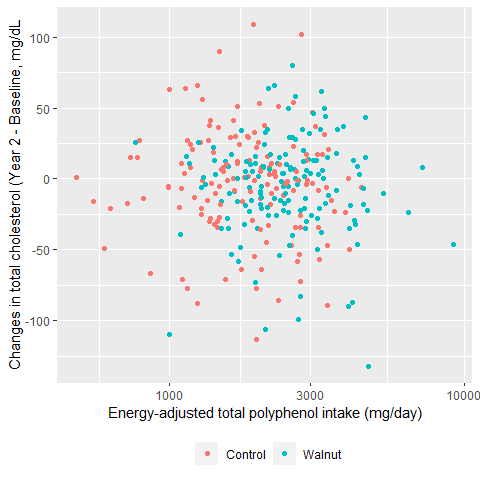
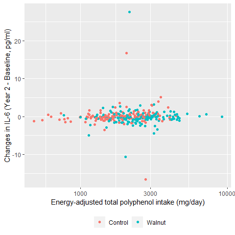

WAHA Polyphenols Study
================

## Datasets

-   A zip file receved from RA:
    `Dietary Polyphenol Lipid and Inflammation files.zip`
    -   Contains:
        -   Lipid file in SPSS: `BDLab_BCNLLU1709lipids.sav`
        -   Inflammation markers file in SPSS:
            `WAHA_ BD_Cytokines_BCN_LLU Inflammation.sav`
        -   Anthropometrics in Excel: `Table1Data.xlsx`
        -   Recall files in CSV:
            `waha-recalls-per-recalls-overlapping-foodgroups-with-pOH.csv`

### Lipid data

-   Includes *n* = 369 subjects.
-   Variables: total cholesterol, LDL, HDL, triglycerides (mg/dL) at
    baseline and year 2. HbA1c values are all missing.

### Inflammatory marker data

-   Includes *n* = 371 subjects.
-   Variables: hsCRP (mg/dL), IL-1 (pg/ml), IL-6 (pg/ml), TNF-a (pg/ml)
    at baseline and year 2.

### Anthropometric data

-   Includes *n* = 356 subjects.
-   Variables: Group, age, gender, race, education, height, weight, BMI,
    etc.

### Dietary recall data

-   Includes 1246 observations from *n* = 334 subjects. The number of
    recalls ranges from 1 to 6 recalls.
    -   There is 1 subject who was not found in lipid and inflammatory
        marker data. This subject was excluded, yielding 1242
        observations from *n* = 333 subjects.
-   Variables: Total energy (kcal/day), total polyphenols, total
    flavonoids, flavanols, phenolic acid, lignin, etc.
-   Dietary polyphenol variables were energy-adjusted each day using the
    residual method and then averaged for each subject.

## Analytic dataset

-   All data files were inner-joined, producing *n* = 333 subjects.
-   For analysis, any subjects who has any missing on lipids and
    inflammatory markers were excluded. This resulted in *n* = 300
    subjects.

## Descriptive table at baseline by treatment

-   Medians (and IQR) were reported for HDL, triglycerides and all
    inflammatory marker variables, as their distributions were
    right-skewed. Mann-Whitney tests were used for these variables for
    comparisons between treatment (`test = nonnormal`)

|                          | level     | Control                 | Walnut                  | p     | test    |
|:-------------------------|:----------|:------------------------|:------------------------|:------|:--------|
| n                        |           | 146                     | 154                     |       |         |
| gender (%)               | F         | 99 (67.8)               | 97 (63.0)               | 0.450 |         |
|                          | M         | 47 (32.2)               | 57 (37.0)               |       |         |
| Race2 (%)                | White     | 111 (76.0)              | 121 (78.6)              | 0.698 |         |
|                          | Non-White | 35 (24.0)               | 33 (21.4)               |       |         |
| age (mean (SD))          |           | 69.42 (3.64)            | 70.08 (4.04)            | 0.141 |         |
| BMI (mean (SD))          |           | 27.65 (4.92)            | 27.47 (5.02)            | 0.744 |         |
| TC_0 (mean (SD))         |           | 190.42 (39.09)          | 182.64 (38.25)          | 0.082 |         |
| LDL_0 (mean (SD))        |           | 116.15 (21.34)          | 113.42 (19.69)          | 0.249 |         |
| HDL_0 (median \[IQR\])   |           | 61.75 \[55.37, 70.18\]  | 58.69 \[52.63, 67.07\]  | 0.027 | nonnorm |
| Trig_0 (median \[IQR\])  |           | 93.50 \[68.00, 124.00\] | 95.00 \[72.50, 130.00\] | 0.519 | nonnorm |
| hsCRP_0 (median \[IQR\]) |           | 0.13 \[0.06, 0.32\]     | 0.16 \[0.07, 0.30\]     | 0.380 | nonnorm |
| IL1_0 (median \[IQR\])   |           | 1.11 \[0.71, 1.47\]     | 1.02 \[0.75, 1.42\]     | 0.695 | nonnorm |
| IL6_0 (median \[IQR\])   |           | 2.17 \[1.23, 3.41\]     | 2.13 \[1.30, 3.35\]     | 0.944 | nonnorm |
| TNFa_0 (median \[IQR\])  |           | 5.36 \[3.91, 6.68\]     | 5.88 \[4.41, 7.01\]     | 0.086 | nonnorm |

-   Inflammatory variables appear to have very large outliers. Check
    with RA.

<!-- -->

## Descriptive table of dietary intake of polyphenols by treatment

-   All polyphenol intake variables were energy-adjusted as mentioned
    above. All dietary polyphenol variabls were right-skewed.

|                                      | Control                      | Walnut                       | p       | test    |
|:-------------------------------------|:-----------------------------|:-----------------------------|:--------|:--------|
| n                                    | 146                          | 154                          |         |         |
| total_polyphenol_ea (median \[IQR\]) | 1897.44 \[1369.07, 2495.67\] | 2479.99 \[1955.63, 3145.86\] | \<0.001 | nonnorm |
| total_flavonoids_ea (median \[IQR\]) | 28.81 \[15.36, 54.38\]       | 56.05 \[41.66, 83.88\]       | \<0.001 | nonnorm |
| flavanols_ea (median \[IQR\])        | 139.59 \[60.65, 277.27\]     | 174.15 \[89.80, 298.37\]     | 0.036   | nonnorm |
| phenolic_acid_ea (median \[IQR\])    | 242.18 \[88.76, 398.33\]     | 367.82 \[245.70, 569.17\]    | \<0.001 | nonnorm |
| lignin_ea (median \[IQR\])           | 27.40 \[13.85, 44.81\]       | 24.14 \[13.39, 44.20\]       | 0.514   | nonnorm |

-   Density plots of dietary polyphenol intakes were shown below.

<!-- -->

## Descriptive table of lipid/inflammatory markers by group and year

-   Mean lipid and inflammator marker variables by group and year
    (baseline and year 2).
    -   Note that mean baseline values were higher in IL-1 and IL-6 for
        the walnut group, but their medians were actually lower (see the
        descriptive table at baseline above).

|                   | 0:Control      | 2:Control      | 0:Walnut       | 2:Walnut       |
|:------------------|:---------------|:---------------|:---------------|:---------------|
| n                 | 146            | 146            | 154            | 154            |
| TC (mean (SD))    | 190.42 (39.09) | 187.29 (41.52) | 182.64 (38.25) | 177.25 (38.00) |
| LDL (mean (SD))   | 116.15 (21.34) | 112.84 (20.91) | 113.42 (19.69) | 108.50 (18.75) |
| HDL (mean (SD))   | 63.26 (11.32)  | 64.96 (11.53)  | 60.87 (12.11)  | 62.45 (11.89)  |
| Trig (mean (SD))  | 105.20 (54.58) | 100.25 (47.02) | 108.19 (52.70) | 103.02 (54.92) |
| hsCRP (mean (SD)) | 0.27 (0.55)    | 0.28 (0.40)    | 0.29 (0.43)    | 0.31 (0.41)    |
| IL1 (mean (SD))   | 1.19 (0.66)    | 1.15 (0.72)    | 1.26 (1.59)    | 1.06 (0.94)    |
| IL6 (mean (SD))   | 2.69 (2.26)    | 2.68 (2.52)    | 2.86 (4.02)    | 2.73 (6.03)    |
| TNFa (mean (SD))  | 5.35 (2.12)    | 5.39 (1.96)    | 5.84 (2.51)    | 5.60 (2.56)    |

-   Changes from baseline were calculated for each subject and then
    average changes were calculated. The walnut group tended to show
    more declines in IL-1, IL-6 and TNF-a.

|                          | Control       | Walnut        |
|:-------------------------|:--------------|:--------------|
| n                        | 146           | 154           |
| TC_change (mean (SD))    | -3.14 (37.33) | -5.39 (33.84) |
| LDL_change (mean (SD))   | -3.31 (21.10) | -4.92 (14.58) |
| HDL_change (mean (SD))   | 1.70 (6.99)   | 1.58 (6.70)   |
| Trig_change (mean (SD))  | -4.95 (40.63) | -5.17 (36.66) |
| hsCRP_change (mean (SD)) | 0.01 (0.54)   | 0.02 (0.48)   |
| IL1_change (mean (SD))   | -0.04 (0.48)  | -0.20 (0.80)  |
| IL6_change (mean (SD))   | 0.00 (2.24)   | -0.13 (2.67)  |
| TNFa_change (mean (SD))  | 0.04 (1.62)   | -0.24 (1.67)  |

## Association b/w dietary polyphenol and the change in lipids

-   For each of lipids (total cholesterol and LDL), a linear models were
    fitted using the change (year 2 - baseline) as the dependent
    variable and the dietary total polyphenols (energy-adjusted) as the
    main independent variable of interest. The model adjusted for the
    baseline value of the lipid being modeled, as well as: gender
    (female as reference), age, BMI and the use of lipid lowering
    medications (yes/no, no as reference) at the baseline.

### Change in TC vs total polyphenol

-   A scatterplot indicated that there is no association between the
    change in TC and dietary polyphenols.

<!-- -->

-   There was no significant association between the change in TC and
    dietary polyphenol intake:

<!-- -->

    ## Model:  TC_change ~ total_polyphenol_ea + TC_0 + age + gender + BMI + lipid_lowering

| Predictor           |    Beta |     SE |     t | p-value |
|:--------------------|--------:|-------:|------:|:--------|
| (Intercept)         |  71.837 | 39.078 |  1.84 | 0.067   |
| total_polyphenol_ea |  -0.002 |  0.002 | -1.34 | 0.181   |
| TC_0                |  -0.447 |  0.053 | -8.44 | \<0.001 |
| age                 |   0.305 |  0.484 |  0.63 | 0.528   |
| genderM             | -11.987 |  4.080 | -2.94 | 0.004   |
| BMI                 |  -0.120 |  0.380 | -0.32 | 0.752   |
| lipid_lowering      |  -4.063 |  4.262 | -0.95 | 0.341   |

### Change in LDL vs total polyphenol

-   A scatterplot indicated that there is no association between the
    change in TC and dietary polyphenols.

<!-- -->

-   There was no significant association between the change in LDL and
    dietary polyphenol intake:

<!-- -->

    ## Model:  LDL_change ~ total_polyphenol_ea + LDL_0 + age + gender + BMI + lipid_lowering

| Predictor           |   Beta |     SE |     t | p-value |
|:--------------------|-------:|-------:|------:|:--------|
| (Intercept)         | 44.146 | 19.257 |  2.29 | 0.023   |
| total_polyphenol_ea |  0.000 |  0.001 | -0.13 | 0.893   |
| LDL_0               | -0.437 |  0.049 | -8.98 | \<0.001 |
| age                 |  0.033 |  0.240 |  0.14 | 0.891   |
| genderM             | -4.923 |  1.990 | -2.47 | 0.014   |
| BMI                 |  0.060 |  0.189 |  0.32 | 0.753   |
| lipid_lowering      | -0.207 |  2.149 | -0.10 | 0.923   |

## Association b/w dietary polyphenol and the change in inflammatory markers

-   For each of inflammatory markers (hsCRP, IL-1, IL-6, TNF-a), a
    linear models were fitted using the change (year 2 - baseline) as
    the dependent variable and the dietary total polyphenols
    (energy-adjusted) as the main independent variable of interest. The
    model adjusted for the baseline value of the inflammatory marker
    being modeld, as well as: gender (female as reference), age, BMI and
    the use of lipid lowering medications (yes/no, no as reference) at
    the baseline.

### Change in hsCRP vs total polyphenol

-   A scatterplot showed there are several outliers in change in hsCRP.
    Check with RA.

<!-- -->

-   There was no significant association between the change in LDL and
    dietary polyphenol intake:

<!-- -->

    ## Model:  hsCRP_change ~ total_polyphenol_ea + hsCRP_0 + age + gender + BMI + lipid_lowering

| Predictor           |   Beta |    SE |      t | p-value |
|:--------------------|-------:|------:|-------:|:--------|
| (Intercept)         | -0.694 | 0.408 |  -1.70 | 0.090   |
| total_polyphenol_ea |  0.000 | 0.000 |   0.29 | 0.775   |
| hsCRP_0             | -0.768 | 0.045 | -17.17 | \<0.001 |
| age                 |  0.004 | 0.005 |   0.79 | 0.433   |
| genderM             | -0.053 | 0.045 |  -1.17 | 0.245   |
| BMI                 |  0.023 | 0.004 |   5.21 | \<0.001 |
| lipid_lowering      | -0.039 | 0.046 |  -0.85 | 0.395   |

### Change in IL-1 vs total polyphenol

-   A scatterplot showed there are several outliers in change in IL-1.
    Check with RA.

<!-- -->

-   There was no significant association between the change in IL-1 and
    dietary polyphenol intake:

<!-- -->

    ## Model:  IL1_change ~ total_polyphenol_ea + IL1_0 + age + gender + BMI + lipid_lowering

| Predictor           |   Beta |    SE |      t | p-value |
|:--------------------|-------:|------:|-------:|:--------|
| (Intercept)         |  0.829 | 0.497 |   1.67 | 0.097   |
| total_polyphenol_ea |  0.000 | 0.000 |   0.06 | 0.955   |
| IL1_0               | -0.414 | 0.021 | -19.98 | \<0.001 |
| age                 | -0.007 | 0.007 |  -1.03 | 0.305   |
| genderM             | -0.041 | 0.054 |  -0.76 | 0.447   |
| BMI                 |  0.002 | 0.005 |   0.33 | 0.741   |
| lipid_lowering      | -0.008 | 0.056 |  -0.15 | 0.882   |

### Change in IL-6 vs total polyphenol

-   A scatterplot showed there are several outliers in change in IL-6.
    Check with RA.

<!-- -->

-   There was no significant association between the change in IL-6 and
    dietary polyphenol intake:

<!-- -->

    ## Model:  IL6_change ~ total_polyphenol_ea + IL6_0 + age + gender + BMI + lipid_lowering

| Predictor           |   Beta |    SE |     t | p-value |
|:--------------------|-------:|------:|------:|:--------|
| (Intercept)         |  1.539 | 2.669 |  0.58 | 0.565   |
| total_polyphenol_ea |  0.000 | 0.000 |  0.76 | 0.445   |
| IL6_0               |  0.229 | 0.043 |  5.36 | \<0.001 |
| age                 | -0.018 | 0.036 | -0.49 | 0.623   |
| genderM             |  0.255 | 0.293 |  0.87 | 0.385   |
| BMI                 | -0.050 | 0.028 | -1.79 | 0.075   |
| lipid_lowering      |  0.153 | 0.305 |  0.50 | 0.616   |

### Change in TNF-a vs total polyphenol

-   A scatterplot indicated that there is no association between the
    change in TNF-a and dietary polyphenols.

<!-- -->

-   There was no significant association between the change in TNF-a and
    dietary polyphenol intake:

<!-- -->

    ## Model:  TNFa_change ~ total_polyphenol_ea + TNFa_0 + age + gender + BMI + lipid_lowering

| Predictor           |   Beta |    SE |     t | p-value |
|:--------------------|-------:|------:|------:|:--------|
| (Intercept)         | -0.091 | 1.730 | -0.05 | 0.958   |
| total_polyphenol_ea |  0.000 | 0.000 |  0.19 | 0.851   |
| TNFa_0              | -0.274 | 0.038 | -7.20 | \<0.001 |
| age                 |  0.027 | 0.023 |  1.16 | 0.248   |
| genderM             | -0.123 | 0.189 | -0.65 | 0.515   |
| BMI                 | -0.016 | 0.018 | -0.90 | 0.368   |
| lipid_lowering      |  0.375 | 0.195 |  1.92 | 0.056   |
