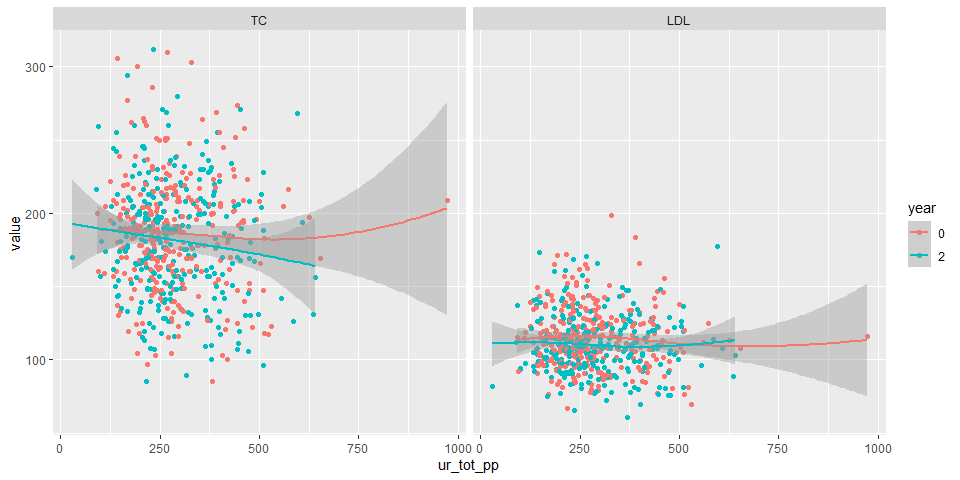

WAHA Polyphenols Study
================

## Datasets

-   A zip file receved from RA:
    `Dietary Polyphenol Lipid and Inflammation files.zip`
    -   Contains:
        -   Lipid file in SPSS: `BDLab_BCNLLU1709lipids.sav`
        -   Inflammation markers file in SPSS:
            `WAHA_ BD_Cytokines_BCN_LLU Inflammation.sav`
        -   Anthropometrics in Excel: `Table1Data.xlsx`
        -   Recall files in CSV:
            `waha-recalls-per-recalls-overlapping-foodgroups-with-pOH.csv`

### Lipid data

-   Includes *n* = 369 subjects.
-   Variables: total cholesterol, LDL, HDL, triglycerides (mg/dL) at
    baseline and year 2. HbA1c values are all missing.

### Inflammatory marker data

-   Includes *n* = 371 subjects.
-   Variables: hsCRP (mg/dL), IL-1 (pg/ml), IL-6 (pg/ml), TNF-a (pg/ml)
    at baseline and year 2.

### Anthropometric data

-   Includes *n* = 356 subjects.
-   Variables: Group, age, gender, race, education, height, weight, BMI,
    etc.

### Dietary recall data

-   Includes 1246 observations from *n* = 334 subjects. The number of
    recalls ranges from 1 to 6 recalls.
    -   There is 1 subject who was not found in lipid and inflammatory
        marker data. This subject was excluded, yielding 1242
        observations from *n* = 333 subjects.
-   Variables: Total energy (kcal/day), total polyphenols, total
    flavonoids, flavanols, phenolic acid, lignin, etc.
-   Dietary polyphenol variables were energy-adjusted each day using the
    residual method and then averaged for each subject.

## Analytic dataset

-   All data files were inner-joined, producing *n* = 333 subjects.
-   For analysis, any subjects who has any missing on lipids and
    inflammatory markers were excluded. This resulted in *n* = 300
    subjects.

## Descriptive table at baseline by treatment

-   Medians (and IQR) were reported for HDL, triglycerides and all
    inflammatory marker variables, as their distributions were
    right-skewed. Mann-Whitney tests were used for these variables for
    comparisons between treatment (`test = nonnormal`)

|                          | level     | Control                 | Walnut                  | p     | test    |
|:-------------------------|:----------|:------------------------|:------------------------|:------|:--------|
| n                        |           | 146                     | 154                     |       |         |
| gender (%)               | F         | 99 (67.8)               | 97 (63.0)               | 0.450 |         |
|                          | M         | 47 (32.2)               | 57 (37.0)               |       |         |
| Race2 (%)                | White     | 111 (76.0)              | 121 (78.6)              | 0.698 |         |
|                          | Non-White | 35 (24.0)               | 33 (21.4)               |       |         |
| age (mean (SD))          |           | 69.42 (3.64)            | 70.08 (4.04)            | 0.141 |         |
| BMI (mean (SD))          |           | 27.65 (4.92)            | 27.47 (5.02)            | 0.744 |         |
| TC_0 (mean (SD))         |           | 190.42 (39.09)          | 182.64 (38.25)          | 0.082 |         |
| LDL_0 (mean (SD))        |           | 116.15 (21.34)          | 113.42 (19.69)          | 0.249 |         |
| HDL_0 (median \[IQR\])   |           | 61.75 \[55.37, 70.18\]  | 58.69 \[52.63, 67.07\]  | 0.027 | nonnorm |
| Trig_0 (median \[IQR\])  |           | 93.50 \[68.00, 124.00\] | 95.00 \[72.50, 130.00\] | 0.519 | nonnorm |
| hsCRP_0 (median \[IQR\]) |           | 0.13 \[0.06, 0.32\]     | 0.16 \[0.07, 0.30\]     | 0.380 | nonnorm |
| IL1_0 (median \[IQR\])   |           | 1.11 \[0.71, 1.47\]     | 1.02 \[0.75, 1.42\]     | 0.695 | nonnorm |
| IL6_0 (median \[IQR\])   |           | 2.17 \[1.23, 3.41\]     | 2.13 \[1.30, 3.35\]     | 0.944 | nonnorm |
| TNFa_0 (median \[IQR\])  |           | 5.36 \[3.91, 6.68\]     | 5.88 \[4.41, 7.01\]     | 0.086 | nonnorm |

-   Inflammatory variables appear to have very large outliers. Check
    with RA.

<!-- -->

## Descriptive table of dietary intake of polyphenols by treatment

-   All polyphenol intake variables were energy-adjusted as mentioned
    above. All dietary polyphenol variabls were right-skewed.

|                                      | Control                      | Walnut                       | p       | test    |
|:-------------------------------------|:-----------------------------|:-----------------------------|:--------|:--------|
| n                                    | 146                          | 154                          |         |         |
| total_polyphenol_ea (median \[IQR\]) | 1897.44 \[1369.07, 2495.67\] | 2479.99 \[1955.63, 3145.86\] | \<0.001 | nonnorm |
| total_flavonoids_ea (median \[IQR\]) | 28.81 \[15.36, 54.38\]       | 56.05 \[41.66, 83.88\]       | \<0.001 | nonnorm |
| flavanols_ea (median \[IQR\])        | 139.59 \[60.65, 277.27\]     | 174.15 \[89.80, 298.37\]     | 0.036   | nonnorm |
| phenolic_acid_ea (median \[IQR\])    | 242.18 \[88.76, 398.33\]     | 367.82 \[245.70, 569.17\]    | \<0.001 | nonnorm |
| lignin_ea (median \[IQR\])           | 27.40 \[13.85, 44.81\]       | 24.14 \[13.39, 44.20\]       | 0.514   | nonnorm |

-   Density plots of dietary polyphenol intakes were shown below.

<!-- -->

## Descriptive table of lipid/inflammatory markers by group and year

-   Mean lipid and inflammator marker variables by group and year
    (baseline and year 2).
    -   Note that mean baseline values were higher in IL-1 and IL-6 for
        the walnut group, but their medians were actually lower (see the
        descriptive table at baseline above).

|                   | 0:Control      | 2:Control      | 0:Walnut       | 2:Walnut       |
|:------------------|:---------------|:---------------|:---------------|:---------------|
| n                 | 146            | 146            | 154            | 154            |
| TC (mean (SD))    | 190.42 (39.09) | 187.29 (41.52) | 182.64 (38.25) | 177.25 (38.00) |
| LDL (mean (SD))   | 116.15 (21.34) | 112.84 (20.91) | 113.42 (19.69) | 108.50 (18.75) |
| HDL (mean (SD))   | 63.26 (11.32)  | 64.96 (11.53)  | 60.87 (12.11)  | 62.45 (11.89)  |
| Trig (mean (SD))  | 105.20 (54.58) | 100.25 (47.02) | 108.19 (52.70) | 103.02 (54.92) |
| hsCRP (mean (SD)) | 0.27 (0.55)    | 0.28 (0.40)    | 0.29 (0.43)    | 0.31 (0.41)    |
| IL1 (mean (SD))   | 1.19 (0.66)    | 1.15 (0.72)    | 1.26 (1.59)    | 1.06 (0.94)    |
| IL6 (mean (SD))   | 2.69 (2.26)    | 2.68 (2.52)    | 2.86 (4.02)    | 2.73 (6.03)    |
| TNFa (mean (SD))  | 5.35 (2.12)    | 5.39 (1.96)    | 5.84 (2.51)    | 5.60 (2.56)    |

-   Changes from baseline were calculated for each subject and then
    average changes were calculated. The walnut group tended to show
    more declines in IL-1, IL-6 and TNF-a.

|                          | Control       | Walnut        |
|:-------------------------|:--------------|:--------------|
| n                        | 146           | 154           |
| TC_change (mean (SD))    | -3.14 (37.33) | -5.39 (33.84) |
| LDL_change (mean (SD))   | -3.31 (21.10) | -4.92 (14.58) |
| HDL_change (mean (SD))   | 1.70 (6.99)   | 1.58 (6.70)   |
| Trig_change (mean (SD))  | -4.95 (40.63) | -5.17 (36.66) |
| hsCRP_change (mean (SD)) | 0.01 (0.54)   | 0.02 (0.48)   |
| IL1_change (mean (SD))   | -0.04 (0.48)  | -0.20 (0.80)  |
| IL6_change (mean (SD))   | 0.00 (2.24)   | -0.13 (2.67)  |
| TNFa_change (mean (SD))  | 0.04 (1.62)   | -0.24 (1.67)  |

## Polyphenol intake by food group

-   Means and SDs of polyphenol intake by food group.
    -   Note that “Misc” group have all zero.

<!-- -->

    ##                                                                             
    ##                 Total_polyphenol          Total_flavonoids          Flavanol
    ##  Food group     Mean             SD       Mean             SD       Mean    
    ##  Animal protein  55.6834          93.7400   0.5713           1.3473  27.8446
    ##  Beverage       845.7642         729.0294  28.8974          76.1575   6.4958
    ##  Chocolates     100.3500         233.2257   0.0000           0.0000  50.9791
    ##  Fat/oil          6.6832           6.0914   0.1916           0.3816   0.0089
    ##  Fruits         396.6888         334.0450  15.2011          22.3603  92.2259
    ##  Grains         126.8576         139.4146   0.7261           5.3708  17.4703
    ##  Legumes        281.3996         619.3581   1.3550           4.0025   6.3917
    ##  Misc             0.0000           0.0000   0.0000           0.0000   0.0000
    ##  Nuts/seeds     343.8405         328.5734  13.2835          13.7084  17.7919
    ##  Spices          26.2777          76.9312   0.0470           0.4948   0.0000
    ##  Vegetables     247.9784         257.5422   8.8869           7.7332   0.1424
    ##                                                   
    ##           Phenolic_acid          Lignan           
    ##  SD       Mean          SD       Mean     SD      
    ##   53.2452   0.2359        1.0787   0.0002   0.0012
    ##   15.7095 227.1104      270.1807   0.6786   2.0181
    ##  121.7216   0.8035        1.9404   0.0197   0.2738
    ##    0.0888   0.0416        0.1863   0.1908   0.3108
    ##  120.5846  18.5902       25.2161   7.6635  11.1338
    ##   60.7345  30.0682       24.8018   1.2692   2.7573
    ##   48.2881   4.8506        9.1244   1.8098   4.1718
    ##    0.0000   0.0000        0.0000   0.0000   0.0000
    ##   19.2961  93.6667       94.8263   1.6922   5.5951
    ##    0.0000   0.0094        0.0287   0.0417   0.1297
    ##    1.2006   4.8368        4.8684  24.3426  38.8629

## Association b/w dietary polyphenol and the change in lipids

-   For each of lipids (total cholesterol and LDL), a linear models were
    fitted using the change (year 2 - baseline) as the dependent
    variable and the dietary total polyphenols (energy-adjusted) as the
    main independent variable of interest.
    -   The unit of dietary total polyphenols was changed to 100 mg/day,
        due to small beta estimates.
    -   The model adjusted for the baseline value of the lipid being
        modeled, as well as: gender (female as reference), age, BMI and
        the use of lipid lowering medications (yes/no, no as reference)
        at the baseline.

### Change in TC vs total polyphenol

-   A scatterplot indicated that there is no association between the
    change in TC and dietary polyphenols.

<!-- -->

-   There was no significant association between the change in TC and
    dietary polyphenol intake:

<!-- -->

    ## Model:  TC_change ~ total_polyphenol_ea_100 + TC_0 + age + gender + BMI + lipid_lowering

| Predictor               |    Beta |     SE |     t | p-value |
|:------------------------|--------:|-------:|------:|:--------|
| (Intercept)             |  65.114 | 38.944 |  1.67 | 0.096   |
| total_polyphenol_ea_100 |  -0.483 |  2.064 | -0.23 | 0.815   |
| TC_0                    |  -0.447 |  0.053 | -8.40 | \<0.001 |
| age                     |   0.329 |  0.487 |  0.68 | 0.500   |
| genderM                 | -12.401 |  4.080 | -3.04 | 0.003   |
| BMI                     |  -0.113 |  0.382 | -0.30 | 0.767   |
| lipid_lowering          |  -3.907 |  4.274 | -0.91 | 0.361   |

### Change in LDL vs total polyphenol

-   A scatterplot indicated that there is no association between the
    change in TC and dietary polyphenols.

<!-- -->

-   There was no significant association between the change in LDL and
    dietary polyphenol intake:

<!-- -->

    ## Model:  LDL_change ~ total_polyphenol_ea_100 + LDL_0 + age + gender + BMI + lipid_lowering

| Predictor               |   Beta |     SE |     t | p-value |
|:------------------------|-------:|-------:|------:|:--------|
| (Intercept)             | 43.699 | 19.068 |  2.29 | 0.023   |
| total_polyphenol_ea_100 | -0.160 |  1.024 | -0.16 | 0.876   |
| LDL_0                   | -0.437 |  0.049 | -8.96 | \<0.001 |
| age                     |  0.037 |  0.241 |  0.15 | 0.879   |
| genderM                 | -4.944 |  1.986 | -2.49 | 0.013   |
| BMI                     |  0.058 |  0.190 |  0.31 | 0.760   |
| lipid_lowering          | -0.191 |  2.148 | -0.09 | 0.929   |

## Association b/w dietary polyphenol and lipids using mixed models

-   To examine if there are any associations between dietary total
    polyphenols (energy-adjusted) and blood lipids (total cholesterol
    and LDL), scatterplots were produced. Lowess smoothed curves were
    fitted for for both years of measurements (Year 0 and Year 2).

-   Scatterplots of TC and LDL (y-axis) against dietary total
    polyphenols (x-axis):

    -   Note that the x-axis is on the log scale

<!-- -->

-   To see if the association between dietary total polyphenols and
    lipids is significant or not, mixed models were fitted using lipids
    (TC or LDL) as the dependent variable and log of energy-adjusted
    dietary total polyphenols as the main independent variable. The
    models included: year (0 or 2), its interaction with dietary
    polyphenol, age, gender and BMI as fixed-effects terms and subjects
    as a random-effects term.
    -   From the mixed model, an estimated slope associated with log
        dietary polyphenol was calculated for each year.
-   Estimated slope for dietary total polyphenol on TC (1st table below)
    and LDL (2nd table) by year:
    -   There was no significant association with TC or LDL at baseline
        or Year 2

<!-- -->

    ## $TC
    ##  year log(total_polyphenol_ea).trend   SE  df t.ratio p.value
    ##     0                           2.03 4.88 454   0.417  0.6771
    ##     2                          -2.53 4.88 454  -0.519  0.6043
    ## 
    ## Results are averaged over the levels of: gender 
    ## Degrees-of-freedom method: kenward-roger 
    ## 
    ## $LDL
    ##  year log(total_polyphenol_ea).trend   SE  df t.ratio p.value
    ##     0                         -0.955 2.58 440  -0.370  0.7119
    ##     2                         -1.093 2.58 440  -0.423  0.6726
    ## 
    ## Results are averaged over the levels of: gender 
    ## Degrees-of-freedom method: kenward-roger

## Association b/w dietary polyphenol and the change in inflammatory markers

-   For each of inflammatory markers (hsCRP, IL-1, IL-6, TNF-a), a
    linear models were fitted using the change (year 2 - baseline) as
    the dependent variable and the dietary total polyphenols
    (energy-adjusted) as the main independent variable of interest. The
    model adjusted for the baseline value of the inflammatory marker
    being modeld, as well as: gender (female as reference), age, BMI and
    the use of lipid lowering medications (yes/no, no as reference) at
    the baseline.

### Change in hsCRP vs total polyphenol

-   A scatterplot showed there are several outliers in change in hsCRP.
    Check with RA.

<!-- -->

-   There was no significant association between the change in LDL and
    dietary polyphenol intake:

<!-- -->

    ## Model:  hsCRP_change ~ total_polyphenol_ea_100 + hsCRP_0 + age + gender + BMI + lipid_lowering

| Predictor               |   Beta |    SE |      t | p-value |
|:------------------------|-------:|------:|-------:|:--------|
| (Intercept)             | -0.677 | 0.404 |  -1.67 | 0.095   |
| total_polyphenol_ea_100 |  0.003 | 0.023 |   0.12 | 0.902   |
| hsCRP_0                 | -0.769 | 0.045 | -17.25 | \<0.001 |
| age                     |  0.004 | 0.005 |   0.77 | 0.444   |
| genderM                 | -0.052 | 0.045 |  -1.15 | 0.252   |
| BMI                     |  0.023 | 0.004 |   5.21 | \<0.001 |
| lipid_lowering          | -0.040 | 0.046 |  -0.86 | 0.390   |

### Change in IL-1 vs total polyphenol

-   A scatterplot showed there are several outliers in change in IL-1.
    Check with RA.

<!-- -->

-   There was no significant association between the change in IL-1 and
    dietary polyphenol intake:

<!-- -->

    ## Model:  IL1_change ~ total_polyphenol_ea_100 + IL1_0 + age + gender + BMI + lipid_lowering

| Predictor               |   Beta |    SE |      t | p-value |
|:------------------------|-------:|------:|-------:|:--------|
| (Intercept)             |  0.832 | 0.492 |   1.69 | 0.092   |
| total_polyphenol_ea_100 | -0.006 | 0.028 |  -0.20 | 0.840   |
| IL1_0                   | -0.414 | 0.021 | -19.95 | \<0.001 |
| age                     | -0.007 | 0.007 |  -1.01 | 0.313   |
| genderM                 | -0.041 | 0.054 |  -0.76 | 0.447   |
| BMI                     |  0.002 | 0.005 |   0.31 | 0.756   |
| lipid_lowering          | -0.008 | 0.056 |  -0.15 | 0.880   |

### Change in IL-6 vs total polyphenol

-   A scatterplot showed there are several outliers in change in IL-6.
    Check with RA.

<!-- -->

-   There was no significant association between the change in IL-6 and
    dietary polyphenol intake:

<!-- -->

    ## Model:  IL6_change ~ total_polyphenol_ea_100 + IL6_0 + age + gender + BMI + lipid_lowering

| Predictor               |   Beta |    SE |     t | p-value |
|:------------------------|-------:|------:|------:|:--------|
| (Intercept)             |  1.848 | 2.642 |  0.70 | 0.485   |
| total_polyphenol_ea_100 |  0.110 | 0.152 |  0.72 | 0.469   |
| IL6_0                   |  0.229 | 0.043 |  5.36 | \<0.001 |
| age                     | -0.020 | 0.036 | -0.57 | 0.572   |
| genderM                 |  0.275 | 0.293 |  0.94 | 0.348   |
| BMI                     | -0.049 | 0.028 | -1.75 | 0.082   |
| lipid_lowering          |  0.147 | 0.305 |  0.48 | 0.631   |

### Change in TNF-a vs total polyphenol

-   A scatterplot indicated that there is no association between the
    change in TNF-a and dietary polyphenols.

<!-- -->

-   There was no significant association between the change in TNF-a and
    dietary polyphenol intake:

<!-- -->

    ## Model:  TNFa_change ~ total_polyphenol_ea_100 + TNFa_0 + age + gender + BMI + lipid_lowering

| Predictor               |   Beta |    SE |     t | p-value |
|:------------------------|-------:|------:|------:|:--------|
| (Intercept)             | -0.065 | 1.708 | -0.04 | 0.969   |
| total_polyphenol_ea_100 | -0.144 | 0.098 | -1.47 | 0.142   |
| TNFa_0                  | -0.274 | 0.038 | -7.26 | \<0.001 |
| age                     |  0.029 | 0.023 |  1.27 | 0.205   |
| genderM                 | -0.125 | 0.188 | -0.67 | 0.506   |
| BMI                     | -0.019 | 0.018 | -1.03 | 0.304   |
| lipid_lowering          |  0.373 | 0.194 |  1.92 | 0.056   |

## Association b/w dietary polyphenol and inflammatory markers using mixed models

-   To examine if there are any associations between dietary total
    polyphenols (energy-adjusted) and inflammatory markers (hsCRP, IL-1,
    IL-6, TNFa), scatterplots were produced. Lowess smoothed curves were
    fitted for for both years of measurements (Year 0 and Year 2).

-   Scatterplots against dietary total polyphenols (x-axis):

    -   Note that the both x- and y-axis are on the log scale

<!-- -->

-   To see if the association between dietary total polyphenols and
    inflammatory markers is significant or not, mixed models were fitted
    using inflammatory markers as the dependent variable and log of
    energy-adjusted dietary total polyphenols as the main independent
    variable. The models included: year (0 or 2), its interaction with
    dietary polyphenol, age, gender and BMI as fixed-effects terms and
    subjects as a random-effects term.
    -   From the mixed model, an estimated slope associated with log
        dietary polyphenol was calculated for each year.
-   Estimated slope for dietary total polyphenol on each inflammatory
    marker by year:
    -   There was no significant association with any of inflammatory
        markers at baseline or Year 2

<!-- -->

    ## $`log(hsCRP)`
    ##  year log(total_polyphenol_ea).trend    SE  df t.ratio p.value
    ##     0                         -0.128 0.133 465  -0.962  0.3364
    ##     2                          0.105 0.133 465   0.786  0.4323
    ## 
    ## Results are averaged over the levels of: gender 
    ## Degrees-of-freedom method: kenward-roger 
    ## 
    ## $`log(IL1)`
    ##  year log(total_polyphenol_ea).trend     SE  df t.ratio p.value
    ##     0                        0.00591 0.0713 381   0.083  0.9340
    ##     2                       -0.03695 0.0713 381  -0.518  0.6045
    ## 
    ## Results are averaged over the levels of: gender 
    ## Degrees-of-freedom method: kenward-roger 
    ## 
    ## $`log(IL6)`
    ##  year log(total_polyphenol_ea).trend    SE  df t.ratio p.value
    ##     0                         -0.139 0.113 412  -1.240  0.2158
    ##     2                          0.069 0.113 412   0.613  0.5401
    ## 
    ## Results are averaged over the levels of: gender 
    ## Degrees-of-freedom method: kenward-roger 
    ## 
    ## $`log(TNFa)`
    ##  year log(total_polyphenol_ea).trend     SE  df t.ratio p.value
    ##     0                        0.00406 0.0637 421   0.064  0.9492
    ##     2                       -0.00780 0.0637 421  -0.122  0.9026
    ## 
    ## Results are averaged over the levels of: gender 
    ## Degrees-of-freedom method: kenward-roger

## Analysis on urinary polyphenol

### Descriptive analysis by treatment and time

-   Means (SD) by treatment and time are shown below for urine
    polyphenol (`ur_tot_pp`) and urine polyphenol / creatinine
    (`ur_tot_pp_cr`):

<!-- -->

    ##                                                                             
    ##                                                                             
    ##       Control                             Walnut                            
    ##       ur_tot_pp        ur_tot_pp_cr       ur_tot_pp       ur_tot_pp_cr      
    ##  Year Mean      SD     Mean         SD    Mean      SD    Mean         SD   
    ##  0    285.1     119.68 313.9        138.8 283.9     100.7 315.4        132.6
    ##  1    278.2      98.97 320.2        122.4 301.7     104.8 344.0        131.9
    ##  2    282.3     109.17 348.6        152.8 292.9     102.9 363.9        163.7

### Comparisons of urine polyphenol between treatment groups over time

-   To compare urine polyphenol between two treatment groups over time,
    mixed models were fitted for both variables (`ur_tot_pp` and
    `ur_tot_pp_cr`). The mixed model included treatment, time, treatment
    x time interaction, age, gender, and BMI as fixed-effects terms and
    subjects as a random-effects term.

    -   From the mixed model, marginal means were estimated for the two
        treatment groups at each time point and then compared, by
        testing for the simple effects of treatment at each time point.

-   **Urine total polyphenol**: Estimated marginal means by treatment
    group at each time point

| group   | time |   emmean |       SE |       df | lower.CL | upper.CL |
|:--------|:-----|---------:|---------:|---------:|---------:|---------:|
| Control | 0    | 285.6736 | 9.180779 | 403.3223 | 267.6254 | 303.7217 |
| Walnut  | 0    | 284.5856 | 8.789272 | 405.0605 | 267.3074 | 301.8639 |
| Control | 1    | 279.1703 | 9.202002 | 406.4504 | 261.0808 | 297.2598 |
| Walnut  | 1    | 302.1807 | 8.800672 | 406.8175 | 284.8803 | 319.4812 |
| Control | 2    | 282.8348 | 9.180779 | 403.3223 | 264.7866 | 300.8829 |
| Walnut  | 2    | 295.4536 | 8.807782 | 407.9137 | 278.1393 | 312.7679 |

-   Comparisons between treatments by time:
    -   There were no significant differences at any time point:

| contrast         | time |  estimate |       SE |       df |   t.ratio |   p.value |
|:-----------------|:-----|----------:|---------:|---------:|----------:|----------:|
| Walnut - Control | 0    | -1.087947 | 12.46745 | 409.5818 | -0.087263 | 0.9305051 |
| Walnut - Control | 1    | 23.010434 | 12.49182 | 412.2459 |  1.842040 | 0.0661874 |
| Walnut - Control | 2    | 12.618831 | 12.48198 | 411.1682 |  1.010964 | 0.3126282 |

-   **Urine total polyphenol adjusted for creatinine**: Estimated
    marginal means by treatment group at each time point

| group   | time |   emmean |       SE |       df | lower.CL | upper.CL |
|:--------|:-----|---------:|---------:|---------:|---------:|---------:|
| Control | 0    | 303.4217 | 12.02285 | 403.6797 | 279.7865 | 327.0569 |
| Walnut  | 0    | 305.0495 | 11.53047 | 402.0494 | 282.3820 | 327.7171 |
| Control | 1    | 308.1292 | 12.02015 | 403.3862 | 284.4993 | 331.7592 |
| Walnut  | 1    | 333.0611 | 11.53310 | 402.3488 | 310.3885 | 355.7338 |
| Control | 2    | 336.7158 | 11.98908 | 399.9791 | 313.1463 | 360.2853 |
| Walnut  | 2    | 355.2142 | 11.52944 | 401.9323 | 332.5486 | 377.8797 |

-   Comparisons between treatments by time:
    -   There were no significant differences at any time point:

| contrast         | time |  estimate |       SE |       df |   t.ratio |   p.value |
|:-----------------|:-----|----------:|---------:|---------:|----------:|----------:|
| Walnut - Control | 0    |  1.627856 | 16.35125 | 408.5749 | 0.0995554 | 0.9207461 |
| Walnut - Control | 1    | 24.931924 | 16.35270 | 408.6957 | 1.5246364 | 0.1281232 |
| Walnut - Control | 2    | 18.498379 | 16.32739 | 406.6432 | 1.1329661 | 0.2578961 |

### Association between dietary polyphenol intake and urine polyphenol excretion

-   To examine if there are any associations between dietary polyphenol
    intake and urine polyphenol at Year 2, scatterplots were produced.
    ~~Dietary intakes (total, flavonoids, flavanols, phenonic acids)
    were energy-adjusted as described above.~~ Note that in the
    scatterplots below the x-axis is on the log-scale. A lowess smoothed
    curve was fitted for each plot.

-   Scatterplots against **urine total polyphenol**:

<!-- -->

-   Scatterplots against **urine total polyphenol adjusted for
    creatinine**:

<!-- -->

-   A linear model was fitted for each combination of urine polyphenol
    (as a dependent variable) and log dietary polyphenol (an independent
    variable), while adjusting for age, gender and BMI.

-   Linear models for **urine total polyphenol**:

    -   There was a significantly **negative** association between urine
        total polyphenol and the log of dietary total flavonoids (p =
        0.0316). There were no significant associations with any other
        dietary polyphenols.

<!-- -->

    ## $log_total_polyphenol
    ##                       Estimate Std. Error t value Pr(>|t|)
    ## (Intercept)           216.3967   154.0658  1.4046   0.1612
    ## log(total_polyphenol)   8.3303    12.9033  0.6456   0.5191
    ## age                    -0.0933     1.6220 -0.0575   0.9542
    ## genderM                 7.9148    13.4697  0.5876   0.5573
    ## BMI                     0.4048     1.2806  0.3161   0.7522
    ## 
    ## $log_total_flavonoids
    ##                       Estimate Std. Error t value Pr(>|t|)
    ## (Intercept)           337.0380   122.3551  2.7546   0.0063
    ## log(total_flavonoids) -14.2729     6.6088 -2.1597   0.0316
    ## age                    -0.0111     1.6100 -0.0069   0.9945
    ## genderM                11.0788    13.0883  0.8465   0.3980
    ## BMI                     0.0686     1.2794  0.0536   0.9573
    ## 
    ## $log_flavanols
    ##                    Estimate Std. Error t value Pr(>|t|)
    ## (Intercept)        257.1619   122.5824  2.0979   0.0368
    ## log(flavanols + 1)   4.7004     5.3475  0.8790   0.3801
    ## age                 -0.1104     1.6212 -0.0681   0.9457
    ## genderM              8.4723    13.2403  0.6399   0.5228
    ## BMI                  0.4438     1.2811  0.3464   0.7293
    ## 
    ## $log_phenolic_acid
    ##                    Estimate Std. Error t value Pr(>|t|)
    ## (Intercept)        293.0093   124.2080  2.3590   0.0190
    ## log(phenolic_acid)  -3.2375     7.0001 -0.4625   0.6441
    ## age                 -0.0246     1.6252 -0.0151   0.9879
    ## genderM             10.2964    13.2290  0.7783   0.4370
    ## BMI                  0.4005     1.2811  0.3126   0.7548

-   Linear models for **urine total polyphenol / creatinine**:
    -   There were no significant associations with any of dietary
        polyphenols.

<!-- -->

    ## $log_total_polyphenol
    ##                       Estimate Std. Error t value Pr(>|t|)
    ## (Intercept)           382.6991   227.1156  1.6850   0.0931
    ## log(total_polyphenol)  12.7925    18.9501  0.6751   0.5002
    ## age                    -1.2801     2.3956 -0.5343   0.5935
    ## genderM               -80.1358    19.8299 -4.0412   0.0001
    ## BMI                    -0.2467     1.8943 -0.1302   0.8965
    ## 
    ## $log_total_flavonoids
    ##                       Estimate Std. Error t value Pr(>|t|)
    ## (Intercept)           548.0577   180.5432  3.0356   0.0026
    ## log(total_flavonoids) -17.2347     9.7593 -1.7660   0.0785
    ## age                    -1.1666     2.3844 -0.4893   0.6250
    ## genderM               -75.9182    19.3548 -3.9225   0.0001
    ## BMI                    -0.6461     1.8965 -0.3407   0.7336
    ## 
    ## $log_flavanols
    ##                    Estimate Std. Error t value Pr(>|t|)
    ## (Intercept)        479.9995   180.8112  2.6547   0.0084
    ## log(flavanols + 1)  -0.2885     8.0885 -0.0357   0.9716
    ## age                 -1.2485     2.3986 -0.5205   0.6031
    ## genderM            -77.3819    19.5416 -3.9599   0.0001
    ## BMI                 -0.2796     1.8973 -0.1474   0.8830
    ## 
    ## $log_phenolic_acid
    ##                    Estimate Std. Error t value Pr(>|t|)
    ## (Intercept)        479.4623   183.3299  2.6153   0.0094
    ## log(phenolic_acid)  -0.1633    10.3095 -0.0158   0.9874
    ## age                 -1.2493     2.4009 -0.5203   0.6033
    ## genderM            -77.4259    19.5113 -3.9683   0.0001
    ## BMI                 -0.2760     1.8957 -0.1456   0.8843

### Association between urine polyphenol and blood lipids

-   To examine if there are any associations between urine polyphenol
    and blood lipids (total cholesterol and LDL), scatterplots were
    produced. Lowess smoothed curves were fitted for for both years of
    measurements (Year 0 and Year 2).

-   Scatterplots of TC and LDL (y-axis) against **urine total
    polyphenol** (x-axis):

<!-- -->

-   Scatterplots of TC and LDL (y-axis) against **urine total polyphenol
    / creatinine** (x-axis):

<!-- -->

-   To see if the association between urine polyphenol and lipids is
    significant or not, mixed models were fitted using lipids (TC or
    LDL) as the dependent variable and urine polyphenol (with or without
    creatinine adjustment) as the main independent variable. The models
    included: year (0 or 2), its interaction with urine polyphenol, age,
    gender and BMI as fixed-effects terms and subjects as a
    random-effects term.
    -   From the mixed model, an estimated slope associated with urine
        polyphenol (divided by 100) was calculated for each year.
-   Estimated slope for **urine total polyphenol** on TC (1st table
    below) and LDL (2nd table) by year:
    -   There was a significant negative association with TC at Year 2
        (p = 0.048).
    -   No significant association was found with LDL.

<!-- -->

    ## $TC
    ##  year I(ur_tot_pp)/100.trend   SE  df t.ratio p.value
    ##  0                     -1.15 1.79 576  -0.645  0.5193
    ##  2                     -3.69 1.86 575  -1.985  0.0476
    ## 
    ## Results are averaged over the levels of: gender 
    ## Degrees-of-freedom method: kenward-roger 
    ## 
    ## $LDL
    ##  year I(ur_tot_pp)/100.trend    SE  df t.ratio p.value
    ##  0                    -0.930 0.929 572  -1.000  0.3175
    ##  2                    -0.694 0.966 571  -0.719  0.4727
    ## 
    ## Results are averaged over the levels of: gender 
    ## Degrees-of-freedom method: kenward-roger

-   Estimated slope for **urine total polyphenol / creatinine** on TC
    (1st table below) and LDL (2nd table) by year:
    -   There was a significant negative association with TC at both
        Year 0 (p = 0.024) and Year 2 (p = 0.0028).
    -   No significant association was found with LDL.

<!-- -->

    ## $TC
    ##  year I(ur_tot_pp_cr)/100.trend   SE  df t.ratio p.value
    ##  0                        -3.42 1.51 557  -2.261  0.0242
    ##  2                        -3.86 1.29 557  -3.000  0.0028
    ## 
    ## Results are averaged over the levels of: gender 
    ## Degrees-of-freedom method: kenward-roger 
    ## 
    ## $LDL
    ##  year I(ur_tot_pp_cr)/100.trend    SE  df t.ratio p.value
    ##  0                        -1.28 0.796 555  -1.612  0.1076
    ##  2                        -0.28 0.677 555  -0.413  0.6795
    ## 
    ## Results are averaged over the levels of: gender 
    ## Degrees-of-freedom method: kenward-roger

### Association between urine polyphenol and inflammatory markers

-   To examine if there are any associations between urine polyphenol
    and inflammatory markers (CRP, IL-1, IL-6, TNF-a), scatterplots were
    produced. lowess smoothed curves was fitted for for both years of
    measurements (Year 0 and Year 2).

-   Scatterplots of inflammatory markers (y-axis) against **urine total
    polyphenol** (x-axis):

<!-- -->

-   Scatterplots of inflammatory markers (y-axis) against **urine total
    polyphenol / creatinine** (x-axis):

<!-- -->

-   To see if the association between urine polyphenol and inflammatory
    marker is significant or not, mixed models were fitted using each
    inflammatory marker as the dependent variable and urine polyphenol
    (with or without creatinine adjustment) as the main independent
    variable. The models included: year (0 or 2), its interaction with
    urine polyphenol, age, gender and BMI as fixed-effects terms and
    subjects as a random-effects term.
    -   From the mixed model, an estimated slope associated with urine
        polyphenol (divided by 100) was calculated for each year.
-   Estimated slope for **urine total polyphenol** on inflammatory
    markers by year:
    -   There were no significant association with any of inflmmatory
        markers.

<!-- -->

    ## $log_hsCRP
    ##  year I(ur_tot_pp)/100.trend     SE  df t.ratio p.value
    ##  0                 -7.62e-05 0.0502 578  -0.002  0.9988
    ##  2                  4.14e-02 0.0522 577   0.793  0.4279
    ## 
    ## Results are averaged over the levels of: gender 
    ## Degrees-of-freedom method: kenward-roger 
    ## 
    ## $log_IL1
    ##  year I(ur_tot_pp)/100.trend     SE  df t.ratio p.value
    ##  0                  -0.00629 0.0228 538  -0.276  0.7830
    ##  2                  -0.02916 0.0237 536  -1.230  0.2193
    ## 
    ## Results are averaged over the levels of: gender 
    ## Degrees-of-freedom method: kenward-roger 
    ## 
    ## $log_IL6
    ##  year I(ur_tot_pp)/100.trend     SE  df t.ratio p.value
    ##  0                   -0.0118 0.0386 562  -0.305  0.7601
    ##  2                   -0.0124 0.0401 560  -0.309  0.7578
    ## 
    ## Results are averaged over the levels of: gender 
    ## Degrees-of-freedom method: kenward-roger 
    ## 
    ## $log_TNFa
    ##  year I(ur_tot_pp)/100.trend     SE  df t.ratio p.value
    ##  0                   -0.0154 0.0222 566  -0.694  0.4878
    ##  2                   -0.0143 0.0231 564  -0.621  0.5349
    ## 
    ## Results are averaged over the levels of: gender 
    ## Degrees-of-freedom method: kenward-roger

-   Estimated slope for **urine total polyphenol / creatinine** on
    inflammatory markers by year:
    -   There were no significant association with any of inflmmatory
        markers.

<!-- -->

    ## $log_hsCRP
    ##  year I(ur_tot_pp_cr)/100.trend     SE  df t.ratio p.value
    ##  0                      -0.0335 0.0429 558  -0.781  0.4350
    ##  2                      -0.0035 0.0364 558  -0.096  0.9236
    ## 
    ## Results are averaged over the levels of: gender 
    ## Degrees-of-freedom method: kenward-roger 
    ## 
    ## $log_IL1
    ##  year I(ur_tot_pp_cr)/100.trend     SE  df t.ratio p.value
    ##  0                      0.00143 0.0192 521   0.075  0.9405
    ##  2                     -0.02577 0.0163 521  -1.582  0.1143
    ## 
    ## Results are averaged over the levels of: gender 
    ## Degrees-of-freedom method: kenward-roger 
    ## 
    ## $log_IL6
    ##  year I(ur_tot_pp_cr)/100.trend     SE  df t.ratio p.value
    ##  0                      0.00359 0.0329 545   0.109  0.9132
    ##  2                     -0.02339 0.0280 545  -0.835  0.4040
    ## 
    ## Results are averaged over the levels of: gender 
    ## Degrees-of-freedom method: kenward-roger 
    ## 
    ## $log_TNFa
    ##  year I(ur_tot_pp_cr)/100.trend     SE  df t.ratio p.value
    ##  0                     -0.00479 0.0191 548  -0.251  0.8020
    ##  2                     -0.01466 0.0162 548  -0.904  0.3665
    ## 
    ## Results are averaged over the levels of: gender 
    ## Degrees-of-freedom method: kenward-roger
