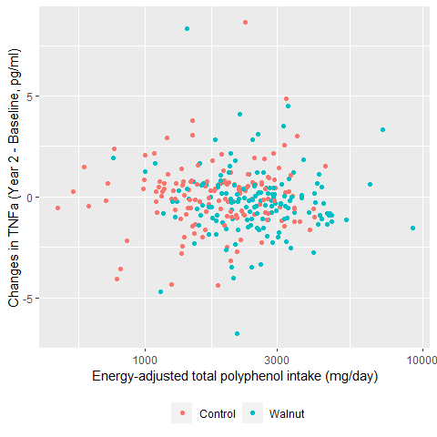
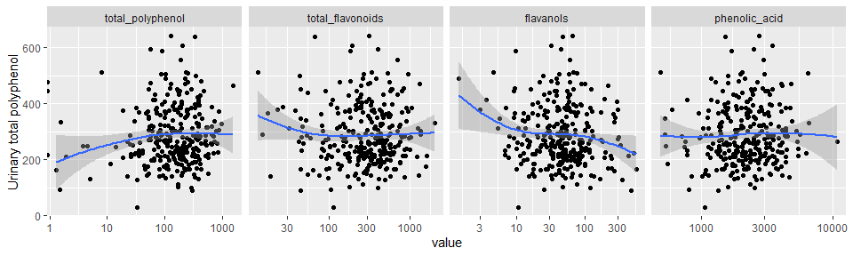

WAHA Polyphenols Study
================

## Datasets

- A zip file receved from RA:
  `Dietary Polyphenol Lipid and Inflammation files.zip`
  - Contains:
    - Lipid file in SPSS: `BDLab_BCNLLU1709lipids.sav`
    - Inflammation markers file in SPSS:
      `WAHA_ BD_Cytokines_BCN_LLU Inflammation.sav`
    - Anthropometrics in Excel: `Table1Data.xlsx`
    - Recall files in CSV:
      `waha-recalls-per-recalls-overlapping-foodgroups-with-pOH.csv`

### Lipid data

- Includes *n* = 369 subjects.
- Variables: total cholesterol, LDL, HDL, triglycerides (mg/dL) at
  baseline and year 2. HbA1c values are all missing.

### Inflammatory marker data

- Includes *n* = 371 subjects.
- Variables: hsCRP (mg/dL), IL-1 (pg/ml), IL-6 (pg/ml), TNF-a (pg/ml) at
  baseline and year 2.

### Anthropometric data

- Includes *n* = 356 subjects.
- Variables: Group, age, gender, race, education, height, weight, BMI,
  etc.

### Dietary recall data

- Includes 1246 observations from *n* = 334 subjects. The number of
  recalls ranges from 1 to 6 recalls.
  - There is 1 subject who was not found in lipid and inflammatory
    marker data. This subject was excluded, yielding 1242 observations
    from *n* = 333 subjects.
- Variables: Total energy (kcal/day), total polyphenols, total
  flavonoids, flavanols, phenolic acid, lignin, etc.
- Dietary polyphenol variables were energy-adjusted each day using the
  residual method and then averaged for each subject.

## Analytic dataset

- All data files were inner-joined, producing *n* = 333 subjects.
- For analysis, any subjects who has any missing on lipids and
  inflammatory markers were excluded. This resulted in *n* = 300
  subjects.

## Descriptive table at baseline by treatment

- Medians (and IQR) were reported for HDL, triglycerides and all
  inflammatory marker variables, as their distributions were
  right-skewed. Mann-Whitney tests were used for these variables for
  comparisons between treatment (`test = nonnormal`)

|                               | level     | Control                 | Walnut                  | p     | test    |
|:------------------------------|:----------|:------------------------|:------------------------|:------|:--------|
| n                             |           | 146                     | 154                     |       |         |
| gender (%)                    | F         | 99 (67.8)               | 97 (63.0)               | 0.450 |         |
|                               | M         | 47 (32.2)               | 57 (37.0)               |       |         |
| age (mean (SD))               |           | 69.42 (3.64)            | 70.08 (4.04)            | 0.141 |         |
| Race2 (%)                     | White     | 111 (76.0)              | 121 (78.6)              | 0.698 |         |
|                               | Non-White | 35 (24.0)               | 33 (21.4)               |       |         |
| educ (%)                      | \<=12 yrs | 19 (13.0)               | 14 ( 9.1)               | 0.368 |         |
|                               | \>12 yrs  | 127 (87.0)              | 140 (90.9)              |       |         |
| ever_smoked (%)               | Never     | 143 (97.9)              | 147 (95.5)              | 0.379 |         |
|                               | Ever      | 3 ( 2.1)                | 7 ( 4.5)                |       |         |
| BMI (mean (SD))               |           | 27.65 (4.92)            | 27.47 (5.02)            | 0.744 |         |
| waist_perimeter (mean (SD))   |           | 98.08 (13.45)           | 98.86 (14.50)           | 0.676 |         |
| hip_circumference (mean (SD)) |           | 106.81 (11.02)          | 105.63 (10.87)          | 0.356 |         |
| TC_0 (mean (SD))              |           | 190.42 (39.09)          | 182.64 (38.25)          | 0.082 |         |
| HDL_0 (median \[IQR\])        |           | 61.75 \[55.37, 70.18\]  | 58.69 \[52.63, 67.07\]  | 0.027 | nonnorm |
| LDL_0 (mean (SD))             |           | 116.15 (21.34)          | 113.42 (19.69)          | 0.249 |         |
| Trig_0 (median \[IQR\])       |           | 93.50 \[68.00, 124.00\] | 95.00 \[72.50, 130.00\] | 0.519 | nonnorm |
| hsCRP_0 (median \[IQR\])      |           | 0.13 \[0.06, 0.32\]     | 0.16 \[0.07, 0.30\]     | 0.380 | nonnorm |
| IL1_0 (median \[IQR\])        |           | 1.11 \[0.71, 1.47\]     | 1.02 \[0.75, 1.42\]     | 0.695 | nonnorm |
| IL6_0 (median \[IQR\])        |           | 2.17 \[1.23, 3.41\]     | 2.13 \[1.30, 3.35\]     | 0.944 | nonnorm |
| TNFa_0 (median \[IQR\])       |           | 5.36 \[3.91, 6.68\]     | 5.88 \[4.41, 7.01\]     | 0.086 | nonnorm |
| bmi_cat (%)                   | undwt     | 1 ( 0.7)                | 2 ( 1.3)                | 0.778 |         |
|                               | norm      | 45 (30.8)               | 50 (32.5)               |       |         |
|                               | ovrwt     | 57 (39.0)               | 64 (41.6)               |       |         |
|                               | obese     | 43 (29.5)               | 38 (24.7)               |       |         |
| diabetes (%)                  | No        | 136 (93.2)              | 141 (91.6)              | 0.763 |         |
|                               | Yes       | 10 ( 6.8)               | 13 ( 8.4)               |       |         |
| statin (%)                    | No        | 98 (67.1)               | 111 (72.1)              | 0.419 |         |
|                               | Yes       | 48 (32.9)               | 43 (27.9)               |       |         |
| lipid_lowering (%)            | No        | 98 (67.1)               | 110 (71.4)              | 0.495 |         |
|                               | Yes       | 48 (32.9)               | 44 (28.6)               |       |         |

- Inflammatory variables appear to have very large outliers. Check with
  RA.

<!-- -->

## Descriptive table of dietary intake by treatment

|                                                      | level | Control          | Walnut           | p       | test |
|:-----------------------------------------------------|:------|:-----------------|:-----------------|:--------|:-----|
| n                                                    |       | 146              | 154              |         |      |
| energy_kcal (mean (SD))                              |       | 1607.71 (452.50) | 1835.90 (535.99) | \<0.001 |      |
| total_carbohydrate_g (mean (SD))                     |       | 194.42 (65.47)   | 206.88 (80.31)   | 0.143   |      |
| percent_calories_from_carbohydrate (mean (SD))       |       | 1604.69 (540.50) | 1674.18 (519.58) | 0.257   |      |
| total_dietary_fiber_g (mean (SD))                    |       | 20.52 (8.47)     | 24.78 (10.79)    | \<0.001 |      |
| total_fat_g (mean (SD))                              |       | 63.01 (22.08)    | 84.49 (26.23)    | \<0.001 |      |
| percent_calories_from_fat (mean (SD))                |       | 807.02 (268.28)  | 868.96 (272.89)  | 0.048   |      |
| total_saturated_fatty_acids_sfa_g (mean (SD))        |       | 20.62 (9.51)     | 21.67 (9.71)     | 0.347   |      |
| percent_calories_from_sfa (mean (SD))                |       | 248.69 (95.59)   | 246.26 (93.86)   | 0.824   |      |
| total_monounsaturated_fatty_acids_mufa_g (mean (SD)) |       | 22.42 (8.58)     | 24.97 (8.81)     | 0.012   |      |
| percent_calories_from_mufa (mean (SD))               |       | 285.70 (99.26)   | 290.64 (104.77)  | 0.676   |      |
| total_polyunsaturated_fatty_acids_pufa_g (mean (SD)) |       | 14.66 (5.51)     | 31.67 (8.37)     | \<0.001 |      |
| percent_calories_from_pufa (mean (SD))               |       | 196.68 (73.88)   | 254.10 (76.42)   | \<0.001 |      |

## Descriptive table of dietary intake of polyphenols by treatment

- All polyphenol intake variables were energy-adjusted as mentioned
  above. All dietary polyphenol variabls were right-skewed.

|                                      | Control                      | Walnut                       | p       | test    |
|:-------------------------------------|:-----------------------------|:-----------------------------|:--------|:--------|
| n                                    | 146                          | 154                          |         |         |
| total_polyphenol_ea (median \[IQR\]) | 1897.44 \[1369.07, 2495.67\] | 2479.99 \[1955.63, 3145.86\] | \<0.001 | nonnorm |
| total_flavonoids_ea (median \[IQR\]) | 28.81 \[15.36, 54.38\]       | 56.05 \[41.66, 83.88\]       | \<0.001 | nonnorm |
| flavanols_ea (median \[IQR\])        | 139.59 \[60.65, 277.27\]     | 174.15 \[89.80, 298.37\]     | 0.036   | nonnorm |
| phenolic_acid_ea (median \[IQR\])    | 242.18 \[88.76, 398.33\]     | 367.82 \[245.70, 569.17\]    | \<0.001 | nonnorm |
| lignin_ea (median \[IQR\])           | 27.40 \[13.85, 44.81\]       | 24.14 \[13.39, 44.20\]       | 0.514   | nonnorm |

- Density plots of dietary polyphenol intakes were shown below.

<!-- -->

## Descriptive table of lipid/inflammatory markers by group and year

- Mean lipid and inflammator marker variables by group and year
  (baseline and year 2).
  - Note that mean baseline values were higher in IL-1 and IL-6 for the
    walnut group, but their medians were actually lower (see the
    descriptive table at baseline above).

|                   | 0:Control      | 2:Control      | 0:Walnut       | 2:Walnut       |
|:------------------|:---------------|:---------------|:---------------|:---------------|
| n                 | 146            | 146            | 154            | 154            |
| TC (mean (SD))    | 190.42 (39.09) | 187.29 (41.52) | 182.64 (38.25) | 177.25 (38.00) |
| LDL (mean (SD))   | 116.15 (21.34) | 112.84 (20.91) | 113.42 (19.69) | 108.50 (18.75) |
| HDL (mean (SD))   | 63.26 (11.32)  | 64.96 (11.53)  | 60.87 (12.11)  | 62.45 (11.89)  |
| Trig (mean (SD))  | 105.20 (54.58) | 100.25 (47.02) | 108.19 (52.70) | 103.02 (54.92) |
| hsCRP (mean (SD)) | 0.27 (0.55)    | 0.28 (0.40)    | 0.29 (0.43)    | 0.31 (0.41)    |
| IL1 (mean (SD))   | 1.19 (0.66)    | 1.15 (0.72)    | 1.26 (1.59)    | 1.06 (0.94)    |
| IL6 (mean (SD))   | 2.69 (2.26)    | 2.68 (2.52)    | 2.86 (4.02)    | 2.73 (6.03)    |
| TNFa (mean (SD))  | 5.35 (2.12)    | 5.39 (1.96)    | 5.84 (2.51)    | 5.60 (2.56)    |

- Changes from baseline were calculated for each subject and then
  average changes were calculated. The walnut group tended to show more
  declines in IL-1, IL-6 and TNF-a.

|                          | Control       | Walnut        |
|:-------------------------|:--------------|:--------------|
| n                        | 146           | 154           |
| TC_change (mean (SD))    | -3.14 (37.33) | -5.39 (33.84) |
| LDL_change (mean (SD))   | -3.31 (21.10) | -4.92 (14.58) |
| HDL_change (mean (SD))   | 1.70 (6.99)   | 1.58 (6.70)   |
| Trig_change (mean (SD))  | -4.95 (40.63) | -5.17 (36.66) |
| hsCRP_change (mean (SD)) | 0.01 (0.54)   | 0.02 (0.48)   |
| IL1_change (mean (SD))   | -0.04 (0.48)  | -0.20 (0.80)  |
| IL6_change (mean (SD))   | 0.00 (2.24)   | -0.13 (2.67)  |
| TNFa_change (mean (SD))  | 0.04 (1.62)   | -0.24 (1.67)  |

## Polyphenol intake by food group

- Means and SDs of polyphenol intake from food groups by group.
  - Note that “Misc” group have all zero.

|                                                | Control         | Walnut          | p       | test |
|:-----------------------------------------------|:----------------|:----------------|:--------|:-----|
| n                                              | 146             | 154             |         |      |
| animal_protein_total_polyphenol (mean (SD))    | 51.35 (77.71)   | 59.79 (106.84)  | 0.437   |      |
| beverage_total_polyphenol (mean (SD))          | 803.73 (674.21) | 885.61 (777.55) | 0.332   |      |
| chocolate_product_total_polyphenol (mean (SD)) | 86.33 (180.33)  | 113.64 (274.07) | 0.311   |      |
| fats_and_oils_total_polyphenols (mean (SD))    | 6.72 (5.99)     | 6.65 (6.21)     | 0.923   |      |
| fruit_total_polyphenol (mean (SD))             | 350.76 (279.82) | 440.23 (374.09) | 0.020   |      |
| grains_total_polyphenol (mean (SD))            | 123.66 (137.78) | 129.89 (141.33) | 0.700   |      |
| legume_total_polyphenol (mean (SD))            | 243.56 (469.55) | 317.27 (733.52) | 0.304   |      |
| miscellaneous_total_polyphenols (mean (SD))    | 0.00 (0.00)     | 0.00 (0.00)     | NaN     |      |
| nuts_and_seeds_total_polyphenols (mean (SD))   | 39.61 (77.12)   | 632.26 (182.46) | \<0.001 |      |
| spices_total_polyphenols (mean (SD))           | 21.81 (66.59)   | 30.51 (85.59)   | 0.329   |      |
| vegetable_total_polyphenols (mean (SD))        | 226.33 (190.63) | 268.50 (307.10) | 0.157   |      |
| animal_protein_total_flavonoids (mean (SD))    | 0.45 (1.05)     | 0.69 (1.57)     | 0.124   |      |
| beverage_total_flavonoids (mean (SD))          | 27.39 (71.50)   | 30.32 (80.53)   | 0.740   |      |
| chocolate_product_total_flavonoids (mean (SD)) | 0.00 (0.00)     | 0.00 (0.00)     | NaN     |      |
| fats_and_oils_total_flavonoids (mean (SD))     | 0.23 (0.49)     | 0.16 (0.24)     | 0.133   |      |
| fruit_total_flavonoids (mean (SD))             | 14.74 (22.60)   | 15.63 (22.20)   | 0.731   |      |
| grains_total_flavonoids (mean (SD))            | 1.13 (7.55)     | 0.34 (1.41)     | 0.206   |      |
| legume_total_flavonoid (mean (SD))             | 1.34 (5.01)     | 1.37 (2.74)     | 0.948   |      |
| miscellaneous_total_flavonoids (mean (SD))     | 0.00 (0.00)     | 0.00 (0.00)     | NaN     |      |
| nuts_and_seeds_total_flavonoids (mean (SD))    | 0.36 (1.21)     | 25.53 (7.45)    | \<0.001 |      |
| spices_total_flavonoids (mean (SD))            | 0.02 (0.09)     | 0.07 (0.69)     | 0.436   |      |
| vegetable_total_flavonoids (mean (SD))         | 8.64 (7.65)     | 9.12 (7.83)     | 0.597   |      |
| animal_product_flavanol (mean (SD))            | 23.74 (41.55)   | 31.73 (62.23)   | 0.194   |      |
| beverage_flavanol (mean (SD))                  | 7.13 (16.08)    | 5.89 (15.38)    | 0.494   |      |
| chocolate_product_flavanol (mean (SD))         | 42.53 (92.99)   | 58.99 (143.62)  | 0.242   |      |
| fats_and_oils_flavanol (mean (SD))             | 0.01 (0.07)     | 0.01 (0.11)     | 0.835   |      |
| fruit_flavanol (mean (SD))                     | 81.42 (104.44)  | 102.47 (133.65) | 0.131   |      |
| grains_flavanol (mean (SD))                    | 19.53 (72.39)   | 15.52 (47.27)   | 0.568   |      |
| legume_total_flavanol (mean (SD))              | 4.15 (27.65)    | 8.51 (61.83)    | 0.435   |      |
| miscellaneous_flavanol (mean (SD))             | 0.00 (0.00)     | 0.00 (0.00)     | NaN     |      |
| nuts_and_seeds_flavanol (mean (SD))            | 8.54 (21.83)    | 26.57 (10.80)   | \<0.001 |      |
| spices_flavanol (mean (SD))                    | 0.00 (0.00)     | 0.00 (0.00)     | NaN     |      |
| vegetable_flavanol (mean (SD))                 | 0.00 (0.00)     | 0.28 (1.67)     | 0.045   |      |
| animal_protein_phenolic_acid (mean (SD))       | 0.24 (1.18)     | 0.23 (0.98)     | 0.944   |      |
| beverage_phenolic_acid (mean (SD))             | 213.80 (228.46) | 239.73 (304.73) | 0.407   |      |
| chocolate_product_phenolic_acid (mean (SD))    | 0.65 (1.43)     | 0.95 (2.32)     | 0.194   |      |
| fats_and_oils_phenolic_acid (mean (SD))        | 0.05 (0.19)     | 0.04 (0.18)     | 0.659   |      |
| fruit_phenolic_acid (mean (SD))                | 16.03 (24.70)   | 21.02 (25.54)   | 0.087   |      |
| grains_phenolic_acids (mean (SD))              | 29.61 (22.91)   | 30.50 (26.54)   | 0.756   |      |
| legume_phenolic_acid (mean (SD))               | 4.27 (7.79)     | 5.40 (10.23)    | 0.282   |      |
| miscellaneous_phenolic_acid (mean (SD))        | 0.00 (0.00)     | 0.00 (0.00)     | NaN     |      |
| nuts_and_seeds_phenolic_acid (mean (SD))       | 5.00 (16.23)    | 177.73 (52.04)  | \<0.001 |      |
| spices_phenolic_acid (mean (SD))               | 0.01 (0.04)     | 0.01 (0.02)     | 0.151   |      |
| vegetable_phenolic_acid (mean (SD))            | 4.32 (3.93)     | 5.33 (5.58)     | 0.071   |      |
| animal_protein_lignan (mean (SD))              | 0.00 (0.00)     | 0.00 (0.00)     | 0.578   |      |
| beverage_lignan (mean (SD))                    | 0.73 (2.09)     | 0.63 (1.95)     | 0.699   |      |
| chocolate_product_lignan (mean (SD))           | 0.04 (0.39)     | 0.00 (0.01)     | 0.275   |      |
| fats_and_oils_lignan (mean (SD))               | 0.19 (0.27)     | 0.19 (0.34)     | 0.893   |      |
| fruit_lignan (mean (SD))                       | 6.97 (11.54)    | 8.32 (10.73)    | 0.292   |      |
| grains_lignan (mean (SD))                      | 1.48 (3.25)     | 1.07 (2.18)     | 0.197   |      |
| legume_lignan (mean (SD))                      | 1.75 (3.71)     | 1.87 (4.58)     | 0.813   |      |
| miscellaneous_lignan (mean (SD))               | 0.00 (0.00)     | 0.00 (0.00)     | NaN     |      |
| nuts_and_seeds_lignan (mean (SD))              | 1.91 (5.69)     | 1.49 (5.52)     | 0.513   |      |
| spices_lignan (mean (SD))                      | 0.05 (0.16)     | 0.03 (0.09)     | 0.141   |      |
| vegetable_lignan (mean (SD))                   | 22.25 (31.70)   | 26.33 (44.62)   | 0.365   |      |

## Association b/w dietary polyphenol and the change in lipids

- For each of lipids (total cholesterol and LDL), a linear models were
  fitted using the change (year 2 - baseline) as the dependent variable
  and the dietary total polyphenols (energy-adjusted) as the main
  independent variable of interest.
  - The unit of dietary total polyphenols was changed to 100 mg/day, due
    to small beta estimates.
  - The model adjusted for the baseline value of the lipid being
    modeled, as well as: gender (female as reference), age, BMI and the
    use of lipid lowering medications (yes/no, no as reference) at the
    baseline.

### Change in TC vs total polyphenol

- A scatterplot indicated that there is no association between the
  change in TC and dietary polyphenols.

<!-- -->

- There was no significant association between the change in TC and
  dietary polyphenol intake:

<!-- -->

    ## Model:  TC_change ~ total_polyphenol_ea_100 + TC_0 + age + gender + BMI + lipid_lowering

| Predictor               |    Beta |     SE |     t | p-value |
|:------------------------|--------:|-------:|------:|:--------|
| (Intercept)             |  65.114 | 38.944 |  1.67 | 0.096   |
| total_polyphenol_ea_100 |  -0.483 |  2.064 | -0.23 | 0.815   |
| TC_0                    |  -0.447 |  0.053 | -8.40 | \<0.001 |
| age                     |   0.329 |  0.487 |  0.68 | 0.500   |
| genderM                 | -12.401 |  4.080 | -3.04 | 0.003   |
| BMI                     |  -0.113 |  0.382 | -0.30 | 0.767   |
| lipid_lowering          |  -3.907 |  4.274 | -0.91 | 0.361   |

### Change in LDL vs total polyphenol

- A scatterplot indicated that there is no association between the
  change in TC and dietary polyphenols.

<!-- -->

- There was no significant association between the change in LDL and
  dietary polyphenol intake:

<!-- -->

    ## Model:  LDL_change ~ total_polyphenol_ea_100 + LDL_0 + age + gender + BMI + lipid_lowering

| Predictor               |   Beta |     SE |     t | p-value |
|:------------------------|-------:|-------:|------:|:--------|
| (Intercept)             | 43.699 | 19.068 |  2.29 | 0.023   |
| total_polyphenol_ea_100 | -0.160 |  1.024 | -0.16 | 0.876   |
| LDL_0                   | -0.437 |  0.049 | -8.96 | \<0.001 |
| age                     |  0.037 |  0.241 |  0.15 | 0.879   |
| genderM                 | -4.944 |  1.986 | -2.49 | 0.013   |
| BMI                     |  0.058 |  0.190 |  0.31 | 0.760   |
| lipid_lowering          | -0.191 |  2.148 | -0.09 | 0.929   |

## Association b/w dietary polyphenol and lipids using mixed models

- To examine if there are any associations between dietary total
  polyphenols (energy-adjusted) and blood lipids (total cholesterol and
  LDL), scatterplots were produced. Lowess smoothed curves were fitted
  for for both years of measurements (Year 0 and Year 2).

- Scatterplots of TC and LDL (y-axis) against dietary total polyphenols
  (x-axis):

  - Note that the x-axis is on the log scale

<!-- -->

- To see if the association between dietary total polyphenols and lipids
  is significant or not, mixed models were fitted using lipids (TC or
  LDL) as the dependent variable and log of energy-adjusted dietary
  total polyphenols as the main independent variable. The models
  included: year, its interaction with dietary polyphenol, age, gender
  and BMI as fixed-effects terms and subjects as a random-effects term.
  - From the mixed model, an estimated slope associated with log dietary
    polyphenol was calculated for each year.
- Estimated slope for dietary total polyphenol on lipids by year:
  - There was no significant association with any lipids at any year

<!-- -->

    ## $TC
    ##  year log(total_polyphenol_ea).trend   SE  df t.ratio p.value
    ##     0                           2.05 4.78 515   0.428  0.6690
    ##     1                           2.87 4.78 515   0.601  0.5479
    ##     2                          -2.52 4.78 515  -0.527  0.5984
    ## 
    ## Results are averaged over the levels of: gender 
    ## Degrees-of-freedom method: kenward-roger 
    ## 
    ## $LDLa
    ##  year log(total_polyphenol_ea).trend   SE  df t.ratio p.value
    ##     0                         -1.333 4.02 500  -0.332  0.7404
    ##     1                         -0.744 4.02 500  -0.185  0.8533
    ##     2                         -3.696 4.13 537  -0.895  0.3710
    ## 
    ## Results are averaged over the levels of: gender 
    ## Degrees-of-freedom method: kenward-roger 
    ## 
    ## $HDLa
    ##  year log(total_polyphenol_ea).trend   SE  df t.ratio p.value
    ##     0                           1.91 1.73 391   1.102  0.2709
    ##     1                           2.65 1.73 391   1.532  0.1264
    ##     2                           1.10 1.73 391   0.636  0.5254
    ## 
    ## Results are averaged over the levels of: gender 
    ## Degrees-of-freedom method: kenward-roger 
    ## 
    ## $Trig
    ##  year log(total_polyphenol_ea).trend   SE  df t.ratio p.value
    ##     0                           1.14 6.71 434   0.169  0.8656
    ##     1                          -2.22 6.71 434  -0.330  0.7413
    ##     2                          -1.30 6.71 434  -0.194  0.8461
    ## 
    ## Results are averaged over the levels of: gender 
    ## Degrees-of-freedom method: kenward-roger

- Similarly, a mixed model was fitted using log dietary total
  flavonoids, flavanols, and phenolic acid (all energy-adjusted) on
  these lipids.

<!-- -->

    ## $TC
    ##  year log(total_flavonoids_ea).trend   SE  df t.ratio p.value
    ##     0                           2.36 2.29 513   1.031  0.3028
    ##     1                           1.51 2.29 513   0.658  0.5111
    ##     2                           0.93 2.29 513   0.406  0.6848
    ## 
    ## Results are averaged over the levels of: gender 
    ## Degrees-of-freedom method: kenward-roger 
    ## 
    ## $LDLa
    ##  year log(total_flavonoids_ea).trend   SE  df t.ratio p.value
    ##     0                          0.766 1.90 498   0.402  0.6876
    ##     1                          0.604 1.90 498   0.317  0.7511
    ##     2                          0.793 1.94 521   0.410  0.6823
    ## 
    ## Results are averaged over the levels of: gender 
    ## Degrees-of-freedom method: kenward-roger 
    ## 
    ## $HDLa
    ##  year log(total_flavonoids_ea).trend   SE  df t.ratio p.value
    ##     0                          1.191 0.83 390   1.435  0.1520
    ##     1                          1.290 0.83 390   1.555  0.1208
    ##     2                          0.901 0.83 390   1.085  0.2784
    ## 
    ## Results are averaged over the levels of: gender 
    ## Degrees-of-freedom method: kenward-roger 
    ## 
    ## $Trig
    ##  year log(total_flavonoids_ea).trend   SE  df t.ratio p.value
    ##     0                          1.386 3.22 432   0.431  0.6668
    ##     1                         -2.722 3.22 432  -0.846  0.3980
    ##     2                         -0.436 3.22 432  -0.135  0.8924
    ## 
    ## Results are averaged over the levels of: gender 
    ## Degrees-of-freedom method: kenward-roger

    ## $TC
    ##  year log(flavanols_ea + 1).trend   SE  df t.ratio p.value
    ##     0                      -2.822 1.84 514  -1.536  0.1251
    ##     1                       0.225 1.84 514   0.122  0.9026
    ##     2                      -1.199 1.84 514  -0.653  0.5142
    ## 
    ## Results are averaged over the levels of: gender 
    ## Degrees-of-freedom method: kenward-roger 
    ## 
    ## $LDLa
    ##  year log(flavanols_ea + 1).trend   SE  df t.ratio p.value
    ##     0                      -2.385 1.52 499  -1.564  0.1185
    ##     1                      -0.083 1.52 499  -0.054  0.9566
    ##     2                      -1.129 1.53 507  -0.736  0.4620
    ## 
    ## Results are averaged over the levels of: gender 
    ## Degrees-of-freedom method: kenward-roger 
    ## 
    ## $HDLa
    ##  year log(flavanols_ea + 1).trend    SE  df t.ratio p.value
    ##     0                       0.471 0.667 390   0.706  0.4809
    ##     1                       0.711 0.667 390   1.066  0.2873
    ##     2                      -0.202 0.667 390  -0.302  0.7626
    ## 
    ## Results are averaged over the levels of: gender 
    ## Degrees-of-freedom method: kenward-roger 
    ## 
    ## $Trig
    ##  year log(flavanols_ea + 1).trend   SE  df t.ratio p.value
    ##     0                       -4.76 2.58 433  -1.848  0.0653
    ##     1                       -2.28 2.58 433  -0.886  0.3760
    ##     2                       -1.24 2.58 433  -0.480  0.6317
    ## 
    ## Results are averaged over the levels of: gender 
    ## Degrees-of-freedom method: kenward-roger

    ## $TC
    ##  year log(phenolic_acid_ea).trend   SE  df t.ratio p.value
    ##     0                       1.171 2.49 515   0.471  0.6380
    ##     1                       0.456 2.49 515   0.183  0.8545
    ##     2                       0.975 2.49 515   0.392  0.6953
    ## 
    ## Results are averaged over the levels of: gender 
    ## Degrees-of-freedom method: kenward-roger 
    ## 
    ## $LDLa
    ##  year log(phenolic_acid_ea).trend   SE  df t.ratio p.value
    ##     0                      -0.311 2.10 500  -0.148  0.8821
    ##     1                      -0.460 2.10 500  -0.219  0.8266
    ##     2                      -0.303 2.13 522  -0.142  0.8871
    ## 
    ## Results are averaged over the levels of: gender 
    ## Degrees-of-freedom method: kenward-roger 
    ## 
    ## $HDLa
    ##  year log(phenolic_acid_ea).trend    SE  df t.ratio p.value
    ##     0                       0.657 0.902 391   0.728  0.4669
    ##     1                       0.766 0.902 391   0.849  0.3964
    ##     2                       1.049 0.902 391   1.164  0.2453
    ## 
    ## Results are averaged over the levels of: gender 
    ## Degrees-of-freedom method: kenward-roger 
    ## 
    ## $Trig
    ##  year log(phenolic_acid_ea).trend   SE  df t.ratio p.value
    ##     0                       0.635 3.49 433   0.182  0.8558
    ##     1                      -3.352 3.49 433  -0.960  0.3376
    ##     2                      -0.063 3.49 433  -0.018  0.9856
    ## 
    ## Results are averaged over the levels of: gender 
    ## Degrees-of-freedom method: kenward-roger

## Association b/w dietary polyphenol and the change in inflammatory markers

- For each of inflammatory markers (hsCRP, IL-1, IL-6, TNF-a), a linear
  models were fitted using the change (year 2 - baseline) as the
  dependent variable and the dietary total polyphenols (energy-adjusted)
  as the main independent variable of interest. The model adjusted for
  the baseline value of the inflammatory marker being modeld, as well
  as: gender (female as reference), age, BMI and the use of lipid
  lowering medications (yes/no, no as reference) at the baseline.

### Change in hsCRP vs total polyphenol

- A scatterplot showed there are several outliers in change in hsCRP.
  Check with RA.

<!-- -->

- There was no significant association between the change in LDL and
  dietary polyphenol intake:

<!-- -->

    ## Model:  hsCRP_change ~ total_polyphenol_ea_100 + hsCRP_0 + age + gender + BMI + lipid_lowering

| Predictor               |   Beta |    SE |      t | p-value |
|:------------------------|-------:|------:|-------:|:--------|
| (Intercept)             | -0.677 | 0.404 |  -1.67 | 0.095   |
| total_polyphenol_ea_100 |  0.003 | 0.023 |   0.12 | 0.902   |
| hsCRP_0                 | -0.769 | 0.045 | -17.25 | \<0.001 |
| age                     |  0.004 | 0.005 |   0.77 | 0.444   |
| genderM                 | -0.052 | 0.045 |  -1.15 | 0.252   |
| BMI                     |  0.023 | 0.004 |   5.21 | \<0.001 |
| lipid_lowering          | -0.040 | 0.046 |  -0.86 | 0.390   |

### Change in IL-1 vs total polyphenol

- A scatterplot showed there are several outliers in change in IL-1.
  Check with RA.

<!-- -->

- There was no significant association between the change in IL-1 and
  dietary polyphenol intake:

<!-- -->

    ## Model:  IL1_change ~ total_polyphenol_ea_100 + IL1_0 + age + gender + BMI + lipid_lowering

| Predictor               |   Beta |    SE |      t | p-value |
|:------------------------|-------:|------:|-------:|:--------|
| (Intercept)             |  0.832 | 0.492 |   1.69 | 0.092   |
| total_polyphenol_ea_100 | -0.006 | 0.028 |  -0.20 | 0.840   |
| IL1_0                   | -0.414 | 0.021 | -19.95 | \<0.001 |
| age                     | -0.007 | 0.007 |  -1.01 | 0.313   |
| genderM                 | -0.041 | 0.054 |  -0.76 | 0.447   |
| BMI                     |  0.002 | 0.005 |   0.31 | 0.756   |
| lipid_lowering          | -0.008 | 0.056 |  -0.15 | 0.880   |

### Change in IL-6 vs total polyphenol

- A scatterplot showed there are several outliers in change in IL-6.
  Check with RA.

<!-- -->

- There was no significant association between the change in IL-6 and
  dietary polyphenol intake:

<!-- -->

    ## Model:  IL6_change ~ total_polyphenol_ea_100 + IL6_0 + age + gender + BMI + lipid_lowering

| Predictor               |   Beta |    SE |     t | p-value |
|:------------------------|-------:|------:|------:|:--------|
| (Intercept)             |  1.848 | 2.642 |  0.70 | 0.485   |
| total_polyphenol_ea_100 |  0.110 | 0.152 |  0.72 | 0.469   |
| IL6_0                   |  0.229 | 0.043 |  5.36 | \<0.001 |
| age                     | -0.020 | 0.036 | -0.57 | 0.572   |
| genderM                 |  0.275 | 0.293 |  0.94 | 0.348   |
| BMI                     | -0.049 | 0.028 | -1.75 | 0.082   |
| lipid_lowering          |  0.147 | 0.305 |  0.48 | 0.631   |

### Change in TNF-a vs total polyphenol

- A scatterplot indicated that there is no association between the
  change in TNF-a and dietary polyphenols.

<!-- -->

- There was no significant association between the change in TNF-a and
  dietary polyphenol intake:

<!-- -->

    ## Model:  TNFa_change ~ total_polyphenol_ea_100 + TNFa_0 + age + gender + BMI + lipid_lowering

| Predictor               |   Beta |    SE |     t | p-value |
|:------------------------|-------:|------:|------:|:--------|
| (Intercept)             | -0.065 | 1.708 | -0.04 | 0.969   |
| total_polyphenol_ea_100 | -0.144 | 0.098 | -1.47 | 0.142   |
| TNFa_0                  | -0.274 | 0.038 | -7.26 | \<0.001 |
| age                     |  0.029 | 0.023 |  1.27 | 0.205   |
| genderM                 | -0.125 | 0.188 | -0.67 | 0.506   |
| BMI                     | -0.019 | 0.018 | -1.03 | 0.304   |
| lipid_lowering          |  0.373 | 0.194 |  1.92 | 0.056   |

## Association b/w dietary polyphenol and inflammatory markers using mixed models

- To examine if there are any associations between dietary total
  polyphenols (energy-adjusted) and inflammatory markers (hsCRP, IL-1,
  IL-6, TNFa), scatterplots were produced. Lowess smoothed curves were
  fitted for for both years of measurements (Year 0 and Year 2).

- Scatterplots against dietary total polyphenols (x-axis):

  - Note that the both x- and y-axis are on the log scale

<!-- -->

- To see if the association between dietary total polyphenols and
  inflammatory markers is significant or not, mixed models were fitted
  using inflammatory markers as the dependent variable and log of
  energy-adjusted dietary total polyphenols as the main independent
  variable. The models included: year, its interaction with dietary
  polyphenol, age, gender and BMI as fixed-effects terms and subjects as
  a random-effects term.
  - From the mixed model, an estimated slope associated with log dietary
    polyphenol was calculated for each year.
- Estimated slope for dietary total polyphenol on each inflammatory
  marker by year:
  - There was no significant association with any of inflammatory
    markers at any time point

<!-- -->

    ## $`log(hsCRP)`
    ##  year log(total_polyphenol_ea).trend    SE  df t.ratio p.value
    ##     0                        -0.1308 0.129 523  -1.014  0.3111
    ##     1                         0.0267 0.130 533   0.206  0.8370
    ##     2                         0.1018 0.129 523   0.790  0.4302
    ## 
    ## Results are averaged over the levels of: gender 
    ## Degrees-of-freedom method: kenward-roger 
    ## 
    ## $`log(IL1)`
    ##  year log(total_polyphenol_ea).trend     SE  df t.ratio p.value
    ##     0                        0.00591 0.0713 381   0.083  0.9340
    ##     2                       -0.03695 0.0713 381  -0.518  0.6045
    ## 
    ## Results are averaged over the levels of: gender 
    ## Degrees-of-freedom method: kenward-roger 
    ## 
    ## $`log(IL6)`
    ##  year log(total_polyphenol_ea).trend    SE  df t.ratio p.value
    ##     0                         -0.139 0.113 412  -1.240  0.2158
    ##     2                          0.069 0.113 412   0.613  0.5401
    ## 
    ## Results are averaged over the levels of: gender 
    ## Degrees-of-freedom method: kenward-roger 
    ## 
    ## $`log(TNFa)`
    ##  year log(total_polyphenol_ea).trend     SE  df t.ratio p.value
    ##     0                        0.00406 0.0637 421   0.064  0.9492
    ##     2                       -0.00780 0.0637 421  -0.122  0.9026
    ## 
    ## Results are averaged over the levels of: gender 
    ## Degrees-of-freedom method: kenward-roger 
    ## 
    ## $`log(gmcs)`
    ##  year log(total_polyphenol_ea).trend   SE  df t.ratio p.value
    ##     0                         0.0454 0.12 325   0.377  0.7062
    ##     2                         0.0286 0.12 325   0.238  0.8123
    ## 
    ## Results are averaged over the levels of: gender 
    ## Degrees-of-freedom method: kenward-roger 
    ## 
    ## $`log(esel)`
    ##  year log(total_polyphenol_ea).trend     SE  df t.ratio p.value
    ##     0                        -0.0628 0.0626 323  -1.004  0.3161
    ##     2                        -0.0814 0.0626 323  -1.300  0.1946
    ## 
    ## Results are averaged over the levels of: gender 
    ## Degrees-of-freedom method: kenward-roger

- Similarly, a mixed model was fitted using log dietary total
  flavonoids, flavanols, and phenolic acid (all energy-adjusted) on the
  inflammatory markers.

<!-- -->

    ## $`log(hsCRP)`
    ##  year log(total_flavonoids_ea).trend     SE  df t.ratio p.value
    ##     0                        -0.0137 0.0619 521  -0.222  0.8247
    ##     1                         0.0133 0.0623 531   0.213  0.8315
    ##     2                         0.0337 0.0619 521   0.544  0.5866
    ## 
    ## Results are averaged over the levels of: gender 
    ## Degrees-of-freedom method: kenward-roger 
    ## 
    ## $`log(IL1)`
    ##  year log(total_flavonoids_ea).trend     SE  df t.ratio p.value
    ##     0                       -0.00290 0.0342 381  -0.085  0.9325
    ##     2                       -0.00503 0.0342 381  -0.147  0.8830
    ## 
    ## Results are averaged over the levels of: gender 
    ## Degrees-of-freedom method: kenward-roger 
    ## 
    ## $`log(IL6)`
    ##  year log(total_flavonoids_ea).trend     SE  df t.ratio p.value
    ##     0                        -0.0778 0.0539 413  -1.444  0.1494
    ##     2                        -0.0652 0.0539 413  -1.211  0.2266
    ## 
    ## Results are averaged over the levels of: gender 
    ## Degrees-of-freedom method: kenward-roger 
    ## 
    ## $`log(TNFa)`
    ##  year log(total_flavonoids_ea).trend     SE  df t.ratio p.value
    ##     0                       -0.00287 0.0305 419  -0.094  0.9251
    ##     2                       -0.04658 0.0305 419  -1.528  0.1273
    ## 
    ## Results are averaged over the levels of: gender 
    ## Degrees-of-freedom method: kenward-roger 
    ## 
    ## $`log(gmcs)`
    ##  year log(total_flavonoids_ea).trend     SE  df t.ratio p.value
    ##     0                         0.0169 0.0578 324   0.293  0.7695
    ##     2                         0.0239 0.0578 324   0.414  0.6792
    ## 
    ## Results are averaged over the levels of: gender 
    ## Degrees-of-freedom method: kenward-roger 
    ## 
    ## $`log(esel)`
    ##  year log(total_flavonoids_ea).trend   SE  df t.ratio p.value
    ##     0                        -0.0260 0.03 323  -0.867  0.3868
    ##     2                        -0.0468 0.03 323  -1.558  0.1203
    ## 
    ## Results are averaged over the levels of: gender 
    ## Degrees-of-freedom method: kenward-roger

    ## $`log(hsCRP)`
    ##  year log(flavanols_ea + 1).trend     SE  df t.ratio p.value
    ##     0                     -0.0337 0.0496 523  -0.680  0.4969
    ##     1                      0.0230 0.0496 523   0.464  0.6431
    ##     2                      0.0435 0.0496 523   0.876  0.3813
    ## 
    ## Results are averaged over the levels of: gender 
    ## Degrees-of-freedom method: kenward-roger 
    ## 
    ## $`log(IL1)`
    ##  year log(flavanols_ea + 1).trend     SE  df t.ratio p.value
    ##     0                     0.02870 0.0274 381   1.047  0.2957
    ##     2                     0.00874 0.0274 381   0.319  0.7500
    ## 
    ## Results are averaged over the levels of: gender 
    ## Degrees-of-freedom method: kenward-roger 
    ## 
    ## $`log(IL6)`
    ##  year log(flavanols_ea + 1).trend     SE  df t.ratio p.value
    ##     0                     -0.0163 0.0433 412  -0.376  0.7075
    ##     2                      0.0524 0.0433 412   1.210  0.2271
    ## 
    ## Results are averaged over the levels of: gender 
    ## Degrees-of-freedom method: kenward-roger 
    ## 
    ## $`log(TNFa)`
    ##  year log(flavanols_ea + 1).trend     SE  df t.ratio p.value
    ##     0                    -0.00758 0.0245 420  -0.310  0.7569
    ##     2                    -0.02880 0.0245 420  -1.177  0.2399
    ## 
    ## Results are averaged over the levels of: gender 
    ## Degrees-of-freedom method: kenward-roger 
    ## 
    ## $`log(gmcs)`
    ##  year log(flavanols_ea + 1).trend     SE  df t.ratio p.value
    ##     0                      0.0266 0.0463 325   0.574  0.5662
    ##     2                      0.0233 0.0463 325   0.503  0.6152
    ## 
    ## Results are averaged over the levels of: gender 
    ## Degrees-of-freedom method: kenward-roger 
    ## 
    ## $`log(esel)`
    ##  year log(flavanols_ea + 1).trend     SE  df t.ratio p.value
    ##     0                     0.00292 0.0241 323   0.121  0.9038
    ##     2                    -0.02277 0.0241 323  -0.944  0.3458
    ## 
    ## Results are averaged over the levels of: gender 
    ## Degrees-of-freedom method: kenward-roger

    ## $`log(hsCRP)`
    ##  year log(phenolic_acid_ea).trend     SE  df t.ratio p.value
    ##     0                     -0.0644 0.0671 523  -0.960  0.3376
    ##     1                      0.0108 0.0674 529   0.161  0.8725
    ##     2                      0.0332 0.0671 523   0.495  0.6209
    ## 
    ## Results are averaged over the levels of: gender 
    ## Degrees-of-freedom method: kenward-roger 
    ## 
    ## $`log(IL1)`
    ##  year log(phenolic_acid_ea).trend     SE  df t.ratio p.value
    ##     0                      0.0063 0.0371 381   0.170  0.8652
    ##     2                     -0.0133 0.0371 381  -0.358  0.7204
    ## 
    ## Results are averaged over the levels of: gender 
    ## Degrees-of-freedom method: kenward-roger 
    ## 
    ## $`log(IL6)`
    ##  year log(phenolic_acid_ea).trend     SE  df t.ratio p.value
    ##     0                     -0.0574 0.0585 412  -0.980  0.3277
    ##     2                      0.0490 0.0585 412   0.837  0.4032
    ## 
    ## Results are averaged over the levels of: gender 
    ## Degrees-of-freedom method: kenward-roger 
    ## 
    ## $`log(TNFa)`
    ##  year log(phenolic_acid_ea).trend     SE  df t.ratio p.value
    ##     0                      0.0139 0.0331 421   0.418  0.6761
    ##     2                      0.0108 0.0331 421   0.325  0.7453
    ## 
    ## Results are averaged over the levels of: gender 
    ## Degrees-of-freedom method: kenward-roger 
    ## 
    ## $`log(gmcs)`
    ##  year log(phenolic_acid_ea).trend     SE  df t.ratio p.value
    ##     0                     0.00972 0.0627 325   0.155  0.8768
    ##     2                    -0.02036 0.0627 325  -0.325  0.7455
    ## 
    ## Results are averaged over the levels of: gender 
    ## Degrees-of-freedom method: kenward-roger 
    ## 
    ## $`log(esel)`
    ##  year log(phenolic_acid_ea).trend     SE  df t.ratio p.value
    ##     0                      0.0137 0.0326 323   0.420  0.6751
    ##     2                      0.0287 0.0326 323   0.880  0.3794
    ## 
    ## Results are averaged over the levels of: gender 
    ## Degrees-of-freedom method: kenward-roger

## Analysis on urinary polyphenol

### Descriptive analysis by treatment and time

- Means (SD) by treatment and time are shown below for urine polyphenol
  (`ur_tot_pp`) and urine polyphenol / creatinine (`ur_tot_pp_cr`):

<!-- -->

    ##                                                                             
    ##                                                                             
    ##       Control                             Walnut                            
    ##       ur_tot_pp        ur_tot_pp_cr       ur_tot_pp       ur_tot_pp_cr      
    ##  Year Mean      SD     Mean         SD    Mean      SD    Mean         SD   
    ##  0    285.1     119.68 313.9        138.8 283.9     100.7 315.4        132.6
    ##  1    278.2      98.97 320.2        122.4 301.7     104.8 344.0        131.9
    ##  2    282.3     109.17 348.6        152.8 292.9     102.9 363.9        163.7

### Comparisons of urine polyphenol between treatment groups over time

- To compare urine polyphenol between two treatment groups over time,
  mixed models were fitted for both variables (`ur_tot_pp` and
  `ur_tot_pp_cr`). The mixed model included treatment, time, treatment x
  time interaction, age, gender, and BMI as fixed-effects terms and
  subjects as a random-effects term.

  - From the mixed model, marginal means were estimated for the two
    treatment groups at each time point and then compared, by testing
    for the simple effects of treatment at each time point.

- **Urine total polyphenol**: Estimated marginal means by treatment
  group at each time point

| group   | time |   emmean |       SE |       df | lower.CL | upper.CL |
|:--------|:-----|---------:|---------:|---------:|---------:|---------:|
| Control | 0    | 285.6736 | 9.180779 | 403.3223 | 267.6254 | 303.7217 |
| Walnut  | 0    | 284.5856 | 8.789272 | 405.0605 | 267.3074 | 301.8639 |
| Control | 1    | 279.1703 | 9.202002 | 406.4504 | 261.0808 | 297.2598 |
| Walnut  | 1    | 302.1807 | 8.800672 | 406.8175 | 284.8803 | 319.4812 |
| Control | 2    | 282.8348 | 9.180779 | 403.3223 | 264.7866 | 300.8829 |
| Walnut  | 2    | 295.4536 | 8.807782 | 407.9137 | 278.1393 | 312.7679 |

- Comparisons between treatments by time:
  - There were no significant differences at any time point:

| contrast         | time |  estimate |       SE |       df |   t.ratio |   p.value |
|:-----------------|:-----|----------:|---------:|---------:|----------:|----------:|
| Walnut - Control | 0    | -1.087947 | 12.46745 | 409.5818 | -0.087263 | 0.9305051 |
| Walnut - Control | 1    | 23.010434 | 12.49182 | 412.2459 |  1.842040 | 0.0661874 |
| Walnut - Control | 2    | 12.618831 | 12.48198 | 411.1682 |  1.010964 | 0.3126282 |

- **Urine total polyphenol adjusted for creatinine**: Estimated marginal
  means by treatment group at each time point

| group   | time |   emmean |       SE |       df | lower.CL | upper.CL |
|:--------|:-----|---------:|---------:|---------:|---------:|---------:|
| Control | 0    | 303.4217 | 12.02285 | 403.6797 | 279.7865 | 327.0569 |
| Walnut  | 0    | 305.0495 | 11.53047 | 402.0494 | 282.3820 | 327.7171 |
| Control | 1    | 308.1292 | 12.02015 | 403.3862 | 284.4993 | 331.7592 |
| Walnut  | 1    | 333.0611 | 11.53310 | 402.3488 | 310.3885 | 355.7338 |
| Control | 2    | 336.7158 | 11.98908 | 399.9791 | 313.1463 | 360.2853 |
| Walnut  | 2    | 355.2142 | 11.52944 | 401.9323 | 332.5486 | 377.8797 |

- Comparisons between treatments by time:
  - There were no significant differences at any time point:

| contrast         | time |  estimate |       SE |       df |   t.ratio |   p.value |
|:-----------------|:-----|----------:|---------:|---------:|----------:|----------:|
| Walnut - Control | 0    |  1.627856 | 16.35125 | 408.5749 | 0.0995554 | 0.9207461 |
| Walnut - Control | 1    | 24.931924 | 16.35270 | 408.6957 | 1.5246364 | 0.1281232 |
| Walnut - Control | 2    | 18.498379 | 16.32739 | 406.6432 | 1.1329661 | 0.2578961 |

### Association between dietary polyphenol intake and urine polyphenol excretion

- To examine if there are any associations between dietary polyphenol
  intake and urine polyphenol at Year 2, scatterplots were produced.
  ~~Dietary intakes (total, flavonoids, flavanols, phenonic acids) were
  energy-adjusted as described above.~~ Note that in the scatterplots
  below the x-axis is on the log-scale. A lowess smoothed curve was
  fitted for each plot.

- Scatterplots against **urine total polyphenol**:

<!-- -->

- Scatterplots against **urine total polyphenol adjusted for
  creatinine**:

<!-- -->

- A linear model was fitted for each combination of urine polyphenol (as
  a dependent variable) and log dietary polyphenol (an independent
  variable), while adjusting for age, gender and BMI.

- Linear models for **urine total polyphenol**:

  - There was a significantly **negative** association between urine
    total polyphenol and the log of dietary total flavonoids (p =
    0.0316). There were no significant associations with any other
    dietary polyphenols.

<!-- -->

    ## $log_total_polyphenol
    ##                       Estimate Std. Error t value Pr(>|t|)
    ## (Intercept)           216.3967   154.0658  1.4046   0.1612
    ## log(total_polyphenol)   8.3303    12.9033  0.6456   0.5191
    ## age                    -0.0933     1.6220 -0.0575   0.9542
    ## genderM                 7.9148    13.4697  0.5876   0.5573
    ## BMI                     0.4048     1.2806  0.3161   0.7522
    ## 
    ## $log_total_flavonoids
    ##                       Estimate Std. Error t value Pr(>|t|)
    ## (Intercept)           337.0380   122.3551  2.7546   0.0063
    ## log(total_flavonoids) -14.2729     6.6088 -2.1597   0.0316
    ## age                    -0.0111     1.6100 -0.0069   0.9945
    ## genderM                11.0788    13.0883  0.8465   0.3980
    ## BMI                     0.0686     1.2794  0.0536   0.9573
    ## 
    ## $log_flavanols
    ##                    Estimate Std. Error t value Pr(>|t|)
    ## (Intercept)        257.1619   122.5824  2.0979   0.0368
    ## log(flavanols + 1)   4.7004     5.3475  0.8790   0.3801
    ## age                 -0.1104     1.6212 -0.0681   0.9457
    ## genderM              8.4723    13.2403  0.6399   0.5228
    ## BMI                  0.4438     1.2811  0.3464   0.7293
    ## 
    ## $log_phenolic_acid
    ##                    Estimate Std. Error t value Pr(>|t|)
    ## (Intercept)        293.0093   124.2080  2.3590   0.0190
    ## log(phenolic_acid)  -3.2375     7.0001 -0.4625   0.6441
    ## age                 -0.0246     1.6252 -0.0151   0.9879
    ## genderM             10.2964    13.2290  0.7783   0.4370
    ## BMI                  0.4005     1.2811  0.3126   0.7548

- Linear models for **urine total polyphenol / creatinine**:
  - There were no significant associations with any of dietary
    polyphenols.

<!-- -->

    ## $log_total_polyphenol
    ##                       Estimate Std. Error t value Pr(>|t|)
    ## (Intercept)           382.6991   227.1156  1.6850   0.0931
    ## log(total_polyphenol)  12.7925    18.9501  0.6751   0.5002
    ## age                    -1.2801     2.3956 -0.5343   0.5935
    ## genderM               -80.1358    19.8299 -4.0412   0.0001
    ## BMI                    -0.2467     1.8943 -0.1302   0.8965
    ## 
    ## $log_total_flavonoids
    ##                       Estimate Std. Error t value Pr(>|t|)
    ## (Intercept)           548.0577   180.5432  3.0356   0.0026
    ## log(total_flavonoids) -17.2347     9.7593 -1.7660   0.0785
    ## age                    -1.1666     2.3844 -0.4893   0.6250
    ## genderM               -75.9182    19.3548 -3.9225   0.0001
    ## BMI                    -0.6461     1.8965 -0.3407   0.7336
    ## 
    ## $log_flavanols
    ##                    Estimate Std. Error t value Pr(>|t|)
    ## (Intercept)        479.9995   180.8112  2.6547   0.0084
    ## log(flavanols + 1)  -0.2885     8.0885 -0.0357   0.9716
    ## age                 -1.2485     2.3986 -0.5205   0.6031
    ## genderM            -77.3819    19.5416 -3.9599   0.0001
    ## BMI                 -0.2796     1.8973 -0.1474   0.8830
    ## 
    ## $log_phenolic_acid
    ##                    Estimate Std. Error t value Pr(>|t|)
    ## (Intercept)        479.4623   183.3299  2.6153   0.0094
    ## log(phenolic_acid)  -0.1633    10.3095 -0.0158   0.9874
    ## age                 -1.2493     2.4009 -0.5203   0.6033
    ## genderM            -77.4259    19.5113 -3.9683   0.0001
    ## BMI                 -0.2760     1.8957 -0.1456   0.8843

### Association between urine polyphenol and blood lipids

- To examine if there are any associations between urine polyphenol and
  blood lipids (total cholesterol and LDL), scatterplots were produced.
  Lowess smoothed curves were fitted for for both years of measurements
  (Year 0 and Year 2).

- Scatterplots of TC and LDL (y-axis) against **urine total polyphenol**
  (x-axis):

<!-- -->

- Scatterplots of TC and LDL (y-axis) against **urine total polyphenol /
  creatinine** (x-axis):

<!-- -->

- To see if the association between urine polyphenol and lipids is
  significant or not, mixed models were fitted using lipids (TC or LDL)
  as the dependent variable and urine polyphenol (with or without
  creatinine adjustment) as the main independent variable. The models
  included: year, its interaction with urine polyphenol, age, gender and
  BMI as fixed-effects terms and subjects as a random-effects term.
  - From the mixed model, an estimated slope associated with urine
    polyphenol (divided by 100) was calculated for each year.
- Estimated slope for **urine total polyphenol** on TC (1st table below)
  and LDL (2nd table) by year:
  - There was a significant negative association with TC at Year 2 (p =
    0.048).
  - No significant association was found with LDL.

<!-- -->

    ## $TC
    ##  year I(ur_tot_pp)/100.trend   SE  df t.ratio p.value
    ##  0                     -1.15 1.79 576  -0.645  0.5193
    ##  2                     -3.69 1.86 575  -1.985  0.0476
    ## 
    ## Results are averaged over the levels of: gender 
    ## Degrees-of-freedom method: kenward-roger 
    ## 
    ## $LDL
    ##  year I(ur_tot_pp)/100.trend    SE  df t.ratio p.value
    ##  0                    -0.930 0.929 572  -1.000  0.3175
    ##  2                    -0.694 0.966 571  -0.719  0.4727
    ## 
    ## Results are averaged over the levels of: gender 
    ## Degrees-of-freedom method: kenward-roger

- Estimated slope for **urine total polyphenol / creatinine** on blood
  lipids by year:

<!-- -->

    ## $TC
    ## Linear mixed model fit by REML. t-tests use Satterthwaite's method [
    ## lmerModLmerTest]
    ## Formula: 
    ## TC ~ I(ur_tot_pp_cr/100) * year + age + gender + BMI + (1 | patient_id)
    ##    Data: urine_comp_long_a
    ## 
    ## REML criterion at convergence: 8170.7
    ## 
    ## Scaled residuals: 
    ##     Min      1Q  Median      3Q     Max 
    ## -3.0643 -0.4578 -0.0100  0.4602  3.9201 
    ## 
    ## Random effects:
    ##  Groups     Name        Variance Std.Dev.
    ##  patient_id (Intercept) 772.0    27.78   
    ##  Residual               527.9    22.98   
    ## Number of obs: 848, groups:  patient_id, 285
    ## 
    ## Fixed effects:
    ##                            Estimate Std. Error        df t value Pr(>|t|)    
    ## (Intercept)               259.10669   35.46629 289.17260   7.306  2.7e-12 ***
    ## I(ur_tot_pp_cr/100)        -3.70541    1.35096 828.65780  -2.743  0.00622 ** 
    ## year1                      -5.52832    5.35015 581.46668  -1.033  0.30189    
    ## year2                      -3.98075    4.98892 576.82264  -0.798  0.42525    
    ## age                        -0.32999    0.47634 281.60493  -0.693  0.48902    
    ## genderM                   -26.27531    3.93291 292.32800  -6.681  1.2e-10 ***
    ## BMI                        -1.03717    0.37423 281.51768  -2.772  0.00595 ** 
    ## I(ur_tot_pp_cr/100):year1   2.12790    1.53540 582.06853   1.386  0.16631    
    ## I(ur_tot_pp_cr/100):year2  -0.02769    1.38709 584.98513  -0.020  0.98408    
    ## ---
    ## Signif. codes:  0 '***' 0.001 '**' 0.01 '*' 0.05 '.' 0.1 ' ' 1
    ## 
    ## Correlation of Fixed Effects:
    ##              (Intr) I(r___/100) year1  year2  age    gendrM BMI    I(___/100):1
    ## I(r___/100)  -0.129                                                            
    ## year1        -0.067  0.439                                                     
    ## year2        -0.071  0.524       0.487                                         
    ## age          -0.948  0.009       0.002 -0.002                                  
    ## genderM       0.052  0.148      -0.016  0.006 -0.081                           
    ## BMI          -0.326 -0.016       0.011 -0.004  0.045 -0.112                    
    ## I(___/100):1  0.065 -0.507      -0.931 -0.461 -0.001  0.010 -0.011             
    ## I(___/100):2  0.074 -0.643      -0.470 -0.918  0.002 -0.024  0.007  0.524      
    ## 
    ## $LDL
    ## Linear mixed model fit by REML. t-tests use Satterthwaite's method [
    ## lmerModLmerTest]
    ## Formula: LDLa ~ I(ur_tot_pp_cr/100) + year + age + gender + BMI + (1 |  
    ##     patient_id) + I(ur_tot_pp_cr/100):year
    ##    Data: urine_comp_long_a
    ## 
    ## REML criterion at convergence: 7696.2
    ## 
    ## Scaled residuals: 
    ##     Min      1Q  Median      3Q     Max 
    ## -2.9911 -0.4717 -0.0284  0.4384  4.0631 
    ## 
    ## Random effects:
    ##  Groups     Name        Variance Std.Dev.
    ##  patient_id (Intercept) 555.6    23.57   
    ##  Residual               358.9    18.94   
    ## Number of obs: 830, groups:  patient_id, 284
    ## 
    ## Fixed effects:
    ##                           Estimate Std. Error       df t value Pr(>|t|)    
    ## (Intercept)               163.7949    30.1525 287.9838   5.432 1.19e-07 ***
    ## I(ur_tot_pp_cr/100)        -2.8725     1.1234 808.2513  -2.557   0.0107 *  
    ## year1                      -8.7720     4.4174 564.2796  -1.986   0.0475 *  
    ## year2                      -0.3968     4.1839 561.4936  -0.095   0.9245    
    ## age                        -0.3277     0.4058 281.6117  -0.808   0.4200    
    ## genderM                   -13.4195     3.3397 291.2692  -4.018 7.47e-05 ***
    ## BMI                        -0.5555     0.3166 280.5421  -1.755   0.0804 .  
    ## I(ur_tot_pp_cr/100):year1   2.5193     1.2684 564.9294   1.986   0.0475 *  
    ## I(ur_tot_pp_cr/100):year2   0.5173     1.1590 569.0304   0.446   0.6556    
    ## ---
    ## Signif. codes:  0 '***' 0.001 '**' 0.01 '*' 0.05 '.' 0.1 ' ' 1
    ## 
    ## Correlation of Fixed Effects:
    ##              (Intr) I(r___/100) year1  year2  age    gendrM BMI    I(___/100):1
    ## I(r___/100)  -0.123                                                            
    ## year1        -0.066  0.434                                                     
    ## year2        -0.067  0.512       0.479                                         
    ## age          -0.949  0.005       0.003 -0.003                                  
    ## genderM       0.063  0.150      -0.017  0.008 -0.092                           
    ## BMI          -0.323 -0.015       0.012 -0.001  0.043 -0.112                    
    ## I(___/100):1  0.062 -0.501      -0.931 -0.454 -0.001  0.010 -0.012             
    ## I(___/100):2  0.069 -0.634      -0.464 -0.917  0.005 -0.027  0.006  0.517      
    ## 
    ## $HDL
    ## Linear mixed model fit by REML. t-tests use Satterthwaite's method [
    ## lmerModLmerTest]
    ## Formula: HDLa ~ I(ur_tot_pp_cr/100) + year + age + gender + BMI + (1 |  
    ##     patient_id) + I(ur_tot_pp_cr/100):year
    ##    Data: urine_comp_long_a
    ## 
    ## REML criterion at convergence: 6162.5
    ## 
    ## Scaled residuals: 
    ##     Min      1Q  Median      3Q     Max 
    ## -2.7801 -0.4715 -0.0157  0.4047  5.7833 
    ## 
    ## Random effects:
    ##  Groups     Name        Variance Std.Dev.
    ##  patient_id (Intercept) 132.20   11.498  
    ##  Residual                37.26    6.104  
    ## Number of obs: 848, groups:  patient_id, 285
    ## 
    ## Fixed effects:
    ##                            Estimate Std. Error        df t value Pr(>|t|)    
    ## (Intercept)                88.47453   13.78579 284.94727   6.418 5.75e-10 ***
    ## I(ur_tot_pp_cr/100)        -0.25369    0.39322 767.77468  -0.645   0.5190    
    ## year1                       2.45238    1.42946 569.49167   1.716   0.0868 .  
    ## year2                      -2.04284    1.33105 565.86600  -1.535   0.1254    
    ## age                        -0.05314    0.18591 280.23816  -0.286   0.7752    
    ## genderM                   -12.51152    1.52463 289.30542  -8.206 7.59e-15 ***
    ## BMI                        -0.94315    0.14606 280.23646  -6.457 4.69e-10 ***
    ## I(ur_tot_pp_cr/100):year1  -0.22578    0.41022 568.97756  -0.550   0.5823    
    ## I(ur_tot_pp_cr/100):year2  -0.55140    0.37093 571.27596  -1.487   0.1377    
    ## ---
    ## Signif. codes:  0 '***' 0.001 '**' 0.01 '*' 0.05 '.' 0.1 ' ' 1
    ## 
    ## Correlation of Fixed Effects:
    ##              (Intr) I(r___/100) year1  year2  age    gendrM BMI    I(___/100):1
    ## I(r___/100)  -0.098                                                            
    ## year1        -0.044  0.383                                                     
    ## year2        -0.049  0.482       0.487                                         
    ## age          -0.951  0.007       0.001 -0.001                                  
    ## genderM       0.060  0.123      -0.015  0.004 -0.082                           
    ## BMI          -0.328 -0.014       0.008 -0.003  0.044 -0.110                    
    ## I(___/100):1  0.043 -0.451      -0.932 -0.462 -0.001  0.009 -0.008             
    ## I(___/100):2  0.053 -0.611      -0.468 -0.917  0.001 -0.020  0.005  0.522      
    ## 
    ## $Trig
    ## Linear mixed model fit by REML. t-tests use Satterthwaite's method [
    ## lmerModLmerTest]
    ## Formula: Trig ~ I(ur_tot_pp_cr/100) + year + age + gender + BMI + (1 |  
    ##     patient_id) + I(ur_tot_pp_cr/100):year
    ##    Data: urine_comp_long_a
    ## 
    ## REML criterion at convergence: 8595.8
    ## 
    ## Scaled residuals: 
    ##     Min      1Q  Median      3Q     Max 
    ## -4.7954 -0.4260 -0.0918  0.3522  4.7854 
    ## 
    ## Random effects:
    ##  Groups     Name        Variance Std.Dev.
    ##  patient_id (Intercept) 1944     44.09   
    ##  Residual                742     27.24   
    ## Number of obs: 848, groups:  patient_id, 285
    ## 
    ## Fixed effects:
    ##                           Estimate Std. Error       df t value Pr(>|t|)    
    ## (Intercept)                58.7248    53.7434 286.5328   1.093   0.2754    
    ## I(ur_tot_pp_cr/100)        -2.8668     1.7057 795.4389  -1.681   0.0932 .  
    ## year1                       0.1498     6.3686 573.2249   0.024   0.9812    
    ## year2                      -3.3173     5.9329 569.1641  -0.559   0.5763    
    ## age                        -0.1037     0.7239 280.9123  -0.143   0.8861    
    ## genderM                     1.2375     5.9498 290.8695   0.208   0.8354    
    ## BMI                         2.3179     0.5687 280.8903   4.076 5.98e-05 ***
    ## I(ur_tot_pp_cr/100):year1   0.3702     1.8277 572.9265   0.203   0.8396    
    ## I(ur_tot_pp_cr/100):year2  -0.1673     1.6522 575.4947  -0.101   0.9194    
    ## ---
    ## Signif. codes:  0 '***' 0.001 '**' 0.01 '*' 0.05 '.' 0.1 ' ' 1
    ## 
    ## Correlation of Fixed Effects:
    ##              (Intr) I(r___/100) year1  year2  age    gendrM BMI    I(___/100):1
    ## I(r___/100)  -0.108                                                            
    ## year1        -0.051  0.400                                                     
    ## year2        -0.056  0.495       0.487                                         
    ## age          -0.950  0.008       0.002 -0.001                                  
    ## genderM       0.057  0.133      -0.016  0.005 -0.082                           
    ## BMI          -0.327 -0.015       0.009 -0.003  0.044 -0.111                    
    ## I(___/100):1  0.050 -0.468      -0.932 -0.462 -0.001  0.010 -0.009             
    ## I(___/100):2  0.060 -0.621      -0.469 -0.917  0.001 -0.022  0.006  0.522

    ## $TC
    ##  year I(ur_tot_pp_cr)/100.trend   SE  df t.ratio p.value
    ##  0                        -3.71 1.35 829  -2.738  0.0063
    ##  1                        -1.58 1.44 832  -1.092  0.2753
    ##  2                        -3.73 1.16 832  -3.222  0.0013
    ## 
    ## Results are averaged over the levels of: gender 
    ## Degrees-of-freedom method: kenward-roger 
    ## 
    ## $LDL
    ##  year I(ur_tot_pp_cr)/100.trend    SE  df t.ratio p.value
    ##  0                       -2.873 1.125 808  -2.553  0.0109
    ##  1                       -0.353 1.204 812  -0.293  0.7693
    ##  2                       -2.355 0.978 809  -2.408  0.0163
    ## 
    ## Results are averaged over the levels of: gender 
    ## Degrees-of-freedom method: kenward-roger 
    ## 
    ## $HDL
    ##  year I(ur_tot_pp_cr)/100.trend    SE  df t.ratio p.value
    ##  0                       -0.254 0.394 768  -0.644  0.5196
    ##  1                       -0.479 0.422 773  -1.137  0.2560
    ##  2                       -0.805 0.338 773  -2.381  0.0175
    ## 
    ## Results are averaged over the levels of: gender 
    ## Degrees-of-freedom method: kenward-roger 
    ## 
    ## $Trig
    ##  year I(ur_tot_pp_cr)/100.trend   SE  df t.ratio p.value
    ##  0                        -2.87 1.71 795  -1.678  0.0937
    ##  1                        -2.50 1.83 801  -1.366  0.1724
    ##  2                        -3.03 1.47 800  -2.070  0.0388
    ## 
    ## Results are averaged over the levels of: gender 
    ## Degrees-of-freedom method: kenward-roger

### Association between urine polyphenol and inflammatory markers

- To examine if there are any associations between urine polyphenol and
  inflammatory markers (CRP, IL-1, IL-6, TNF-a), scatterplots were
  produced. lowess smoothed curves was fitted for for both years of
  measurements (Year 0 and Year 2).

- Scatterplots of inflammatory markers (y-axis) against **urine total
  polyphenol** (x-axis):

<!-- -->

- Scatterplots of inflammatory markers (y-axis) against **urine total
  polyphenol / creatinine** (x-axis):

<!-- -->

- To see if the association between urine polyphenol and inflammatory
  marker is significant or not, mixed models were fitted using each
  inflammatory marker as the dependent variable and urine polyphenol
  (with or without creatinine adjustment) as the main independent
  variable. The models included: year, its interaction with urine
  polyphenol, age, gender and BMI as fixed-effects terms and subjects as
  a random-effects term.
  - From the mixed model, an estimated slope associated with urine
    polyphenol (divided by 100) was calculated for each year.
- Estimated slope for **urine total polyphenol** on inflammatory markers
  by year:
  - There were no significant association with any of inflmmatory
    markers.

<!-- -->

    ## $log_hsCRP
    ##  year I(ur_tot_pp)/100.trend     SE  df t.ratio p.value
    ##  0                 -7.62e-05 0.0502 578  -0.002  0.9988
    ##  2                  4.14e-02 0.0522 577   0.793  0.4279
    ## 
    ## Results are averaged over the levels of: gender 
    ## Degrees-of-freedom method: kenward-roger 
    ## 
    ## $log_IL1
    ##  year I(ur_tot_pp)/100.trend     SE  df t.ratio p.value
    ##  0                  -0.00629 0.0228 538  -0.276  0.7830
    ##  2                  -0.02916 0.0237 536  -1.230  0.2193
    ## 
    ## Results are averaged over the levels of: gender 
    ## Degrees-of-freedom method: kenward-roger 
    ## 
    ## $log_IL6
    ##  year I(ur_tot_pp)/100.trend     SE  df t.ratio p.value
    ##  0                   -0.0118 0.0386 562  -0.305  0.7601
    ##  2                   -0.0124 0.0401 560  -0.309  0.7578
    ## 
    ## Results are averaged over the levels of: gender 
    ## Degrees-of-freedom method: kenward-roger 
    ## 
    ## $log_TNFa
    ##  year I(ur_tot_pp)/100.trend     SE  df t.ratio p.value
    ##  0                   -0.0154 0.0222 566  -0.694  0.4878
    ##  2                   -0.0143 0.0231 564  -0.621  0.5349
    ## 
    ## Results are averaged over the levels of: gender 
    ## Degrees-of-freedom method: kenward-roger

- Estimated slope for **urine total polyphenol / creatinine** on
  inflammatory markers by year:
  - There were no significant association with any of inflmmatory
    markers.

<!-- -->

    ## $log_hsCRP
    ##  year I(ur_tot_pp_cr)/100.trend     SE  df t.ratio p.value
    ##  0                     -0.04230 0.0374 831  -1.132  0.2581
    ##  1                     -0.01942 0.0399 834  -0.487  0.6267
    ##  2                     -0.00137 0.0320 834  -0.043  0.9658
    ## 
    ## Results are averaged over the levels of: gender 
    ## Degrees-of-freedom method: kenward-roger 
    ## 
    ## $log_IL1
    ##  year I(ur_tot_pp_cr)/100.trend     SE  df t.ratio p.value
    ##  0                      0.00143 0.0192 521   0.075  0.9405
    ##  2                     -0.02577 0.0163 521  -1.582  0.1143
    ## 
    ## Results are averaged over the levels of: gender 
    ## Degrees-of-freedom method: kenward-roger 
    ## 
    ## $log_IL6
    ##  year I(ur_tot_pp_cr)/100.trend     SE  df t.ratio p.value
    ##  0                      0.00359 0.0329 545   0.109  0.9132
    ##  2                     -0.02339 0.0280 545  -0.835  0.4040
    ## 
    ## Results are averaged over the levels of: gender 
    ## Degrees-of-freedom method: kenward-roger 
    ## 
    ## $log_TNFa
    ##  year I(ur_tot_pp_cr)/100.trend     SE  df t.ratio p.value
    ##  0                     -0.00479 0.0191 548  -0.251  0.8020
    ##  2                     -0.01466 0.0162 548  -0.904  0.3665
    ## 
    ## Results are averaged over the levels of: gender 
    ## Degrees-of-freedom method: kenward-roger 
    ## 
    ## $log_GM_CSF
    ##  year I(ur_tot_pp_cr)/100.trend     SE  df t.ratio p.value
    ##  0                     0.028316 0.0237 410   1.194  0.2332
    ##  2                    -0.000726 0.0202 410  -0.036  0.9713
    ## 
    ## Results are averaged over the levels of: gender 
    ## Degrees-of-freedom method: kenward-roger 
    ## 
    ## $log_eselection
    ##  year I(ur_tot_pp_cr)/100.trend     SE  df t.ratio p.value
    ##  0                      -0.0173 0.0120 401  -1.450  0.1478
    ##  2                      -0.0204 0.0102 401  -2.008  0.0453
    ## 
    ## Results are averaged over the levels of: gender 
    ## Degrees-of-freedom method: kenward-roger
